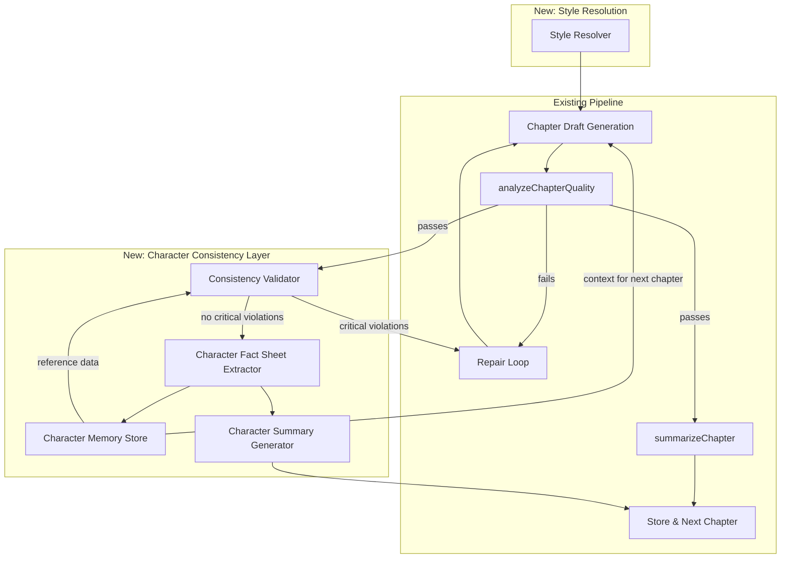

# Design Document: Character Consistency

## Overview

Hệ thống Character Consistency mở rộng pipeline sáng tác truyện Drama15 để duy trì tính nhất quán nhân vật xuyên suốt các chương. Hiện tại, pipeline chỉ truyền Story Bible JSON blob và mảng `previousSummaries` (200 ký tự đầu mỗi chương) — không đủ để theo dõi sự phát triển nhân vật qua 10 chương.

Giải pháp bao gồm 5 module mới tích hợp vào pipeline hiện có:

1. **Character Fact Sheet Extractor** — Trích xuất thông tin nhân vật có cấu trúc sau mỗi chương
2. **Character Memory Store** — Kho lưu trữ tích lũy trạng thái nhân vật qua các chương
3. **Consistency Validator** — Phát hiện character drift bằng cách so sánh chương mới với dữ liệu đã xác lập
4. **Character Summary Generator** — Tóm tắt chương theo nhân vật thay vì theo cốt truyện
5. **Style Resolver** — Giải quyết xung đột phong cách Gu Man vs Drama15

Các module này được thiết kế dưới dạng pure functions (ngoại trừ LLM calls) để dễ test và tích hợp vào repair loop hiện có.

## Architecture



### Pipeline Flow (Updated)

1. **Style Resolution** — `StyleResolver.resolve(storyConfig)` produces a single style block injected into the system prompt
2. **Chapter Draft** — LLM generates chapter with Character_Memory_Store context + Character_Summaries as `previousSummaries`
3. **Quality Check** — Existing `analyzeChapterQuality()` checks word count + dialogue ratio
4. **Consistency Validation** — `ConsistencyValidator.validate(chapter, storyBible, memoryStore)` produces a `DriftReport`
5. **Repair Loop** (if needed) — Extended to handle both quality failures and character drift in a single attempt, max 3 retries
6. **Fact Extraction** — `CharacterFactSheetExtractor.extract(chapter, storyBible)` produces structured facts
7. **Memory Store Update** — Facts are validated and accumulated in `CharacterMemoryStore`
8. **Character Summary** — `CharacterSummaryGenerator.generate(chapter, storyBible)` replaces old `summarizeChapter()`

### Design Decisions

- **LLM-based extraction over rule-based**: Character state (emotions, relationships) is too nuanced for regex/NLP rules in Vietnamese text. LLM extraction with low temperature (0.2) provides structured output with high accuracy.
- **Validation as separate LLM call**: Separating validation from generation allows independent temperature tuning (0.1 for maximum detection accuracy) and avoids self-validation bias.
- **Single repair attempt for combined failures**: Sequential repairs risk oscillation (fixing character drift breaks word count, fixing word count introduces drift). A single combined prompt gives the LLM full context.
- **Graceful degradation over blocking**: If repair exhausts attempts, the pipeline logs warnings and continues rather than blocking story completion — matching the existing pipeline philosophy.

## Components and Interfaces

### 1. CharacterFactSheetExtractor

```typescript
// apps/api/src/storyEngine.ts (new exports)

export interface CharacterFact {
  characterName: string;
  emotionalState: string;
  relationshipChanges: Array<{
    targetCharacter: string;
    change: string;
  }>;
  socialPosition: string;
  newlyEstablishedFacts: Array<{
    fact: string;
    confidence: 'explicit' | 'inferred';
    confidenceLevel?: number; // 0.0-1.0, only for inferred
  }>;
}

export interface CharacterFactSheet {
  chapterNumber: number;
  characters: CharacterFact[];
  extractedAt: string; // ISO-8601
}

export interface FactSheetExtractionOptions {
  chapterText: string;
  chapterNumber: number;
  storyBible: string; // JSON string
  outputLanguage: string;
}

export const TEMPERATURE_FACT_EXTRACTION = 0.2;
export const TEMPERATURE_FACT_EXTRACTION_RETRY = 0.1;

export function buildFactExtractionSystemPrompt(storyBible: string): string;
export function buildFactExtractionUserPrompt(opts: FactSheetExtractionOptions): string;
export function validateCharacterFactSheet(data: unknown): data is CharacterFactSheet;
export function extractCharacterNamesFallback(chapterText: string): CharacterFactSheet;
```

### 2. CharacterMemoryStore

```typescript
// apps/api/src/stories/characterMemoryStore.ts (new file)

export interface CharacterMemoryStore {
  /** All fact sheets indexed by chapter number */
  chapters: Map<number, CharacterFactSheet>;
}

export function createEmptyMemoryStore(): CharacterMemoryStore;
export function addFactSheet(store: CharacterMemoryStore, factSheet: CharacterFactSheet): CharacterMemoryStore;
export function queryByCharacter(store: CharacterMemoryStore, characterName: string): CharacterFact[];
export function serializeMemoryStore(store: CharacterMemoryStore): string;
export function deserializeMemoryStore(json: string): CharacterMemoryStore;
export function memoryStoreToPromptContext(store: CharacterMemoryStore): string;
```

### 3. ConsistencyValidator

```typescript
// apps/api/src/stories/consistencyValidator.ts (new file)

export type ViolationType =
  | 'name_misspelling'
  | 'personality_contradiction'
  | 'relationship_violation'
  | 'social_position_drift'
  | 'emotional_discontinuity';

export type ViolationSeverity = 'critical' | 'warning';

export interface Violation {
  type: ViolationType;
  severity: ViolationSeverity;
  excerpt: string;
  contradictedFact: string;
  characterName: string;
}

export interface DriftReport {
  chapterNumber: number;
  violations: Violation[];
  validatedAt: string; // ISO-8601
}

export const TEMPERATURE_VALIDATION = 0.1;

export function buildValidationSystemPrompt(): string;
export function buildValidationUserPrompt(opts: {
  chapterText: string;
  chapterNumber: number;
  storyBible: string;
  memoryStoreContext: string;
}): string;
export function parseDriftReport(llmOutput: string, chapterNumber: number): DriftReport;
export function classifyViolationSeverity(
  violation: { type: ViolationType; contradictedFact: string },
  storyBibleFacts: string[],
): ViolationSeverity;
export function hasCriticalViolations(report: DriftReport): boolean;
export function createEmptyDriftReport(chapterNumber: number): DriftReport;
```

### 4. CharacterSummaryGenerator

```typescript
// apps/api/src/stories/characterSummary.ts (new file)

export interface CharacterSummaryEntry {
  characterName: string;
  actionsTaken: string;
  emotionalArc: string;
  relationshipInteractions: string;
  statusChanges: string;
}

export interface CharacterSummary {
  chapterNumber: number;
  primaryCharacters: CharacterSummaryEntry[]; // max 5
  collectiveSummary?: string; // for characters beyond top 5
  wordCount: number;
}

export const CHARACTER_SUMMARY_MIN_WORDS = 300;
export const CHARACTER_SUMMARY_MAX_WORDS = 800;
export const MAX_PRIMARY_CHARACTERS = 5;

export function buildCharacterSummarySystemPrompt(): string;
export function buildCharacterSummaryUserPrompt(opts: {
  chapterText: string;
  chapterNumber: number;
  storyBible: string;
}): string;
export function validateCharacterSummary(data: unknown): data is CharacterSummary;
export function characterSummaryToString(summary: CharacterSummary): string;
```

### 5. StyleResolver

```typescript
// apps/api/src/stories/styleResolver.ts (new file)

export type StyleMode = 'drama15_only' | 'gu_man_only' | 'drama15_with_gu_man_overlay';

export interface StyleResolution {
  mode: StyleMode;
  styleBlock: string; // Single coherent block for system prompt injection
  priorityMarkers: string[]; // Explicit priority annotations
}

export interface StoryStyleConfig {
  styleMode?: StyleMode; // undefined defaults to 'drama15_with_gu_man_overlay'
}

export function resolveStyle(config: StoryStyleConfig): StyleResolution;
export function resolveStyleMode(config: StoryStyleConfig): StyleMode;
export function buildStyleBlock(mode: StyleMode): string;
export function containsGuManContent(styleBlock: string): boolean;
export function containsDrama15StructuralOnly(styleBlock: string): boolean;
```

### 6. Extended Repair Loop

```typescript
// Extensions to existing buildChapterRepairUserPrompt in storyEngine.ts

export const MAX_CHAPTER_REPAIR_ATTEMPTS_WITH_DRIFT = 3;

export function buildChapterRepairUserPromptWithDrift(params: {
  previousDraft: string;
  failures: string[];
  driftReport: DriftReport;
  chapterNumber: number;
  dialogueRatio: number;
  wordCount: number;
  currentDialogueRatio: number;
}): string;

export function needsRepair(
  qualityMetrics: ChapterQualityMetrics,
  driftReport: DriftReport,
): boolean;
```

## Data Models

### Character_Fact_Sheet JSON Schema

```json
{
  "$schema": "http://json-schema.org/draft-07/schema#",
  "type": "object",
  "required": ["chapterNumber", "characters", "extractedAt"],
  "properties": {
    "chapterNumber": { "type": "integer", "minimum": 1 },
    "characters": {
      "type": "array",
      "items": {
        "type": "object",
        "required": ["characterName", "emotionalState", "relationshipChanges", "socialPosition", "newlyEstablishedFacts"],
        "properties": {
          "characterName": { "type": "string", "minLength": 1 },
          "emotionalState": { "type": "string" },
          "relationshipChanges": {
            "type": "array",
            "items": {
              "type": "object",
              "required": ["targetCharacter", "change"],
              "properties": {
                "targetCharacter": { "type": "string" },
                "change": { "type": "string" }
              }
            }
          },
          "socialPosition": { "type": "string" },
          "newlyEstablishedFacts": {
            "type": "array",
            "items": {
              "type": "object",
              "required": ["fact", "confidence"],
              "properties": {
                "fact": { "type": "string" },
                "confidence": { "enum": ["explicit", "inferred"] },
                "confidenceLevel": { "type": "number", "minimum": 0, "maximum": 1 }
              }
            }
          }
        }
      }
    },
    "extractedAt": { "type": "string", "format": "date-time" }
  }
}
```

### Character_Memory_Store Serialization Format

```json
{
  "version": 1,
  "chapters": {
    "1": {
      "chapterNumber": 1,
      "characters": [...],
      "extractedAt": "2025-01-15T10:30:00.000Z"
    },
    "2": { ... }
  }
}
```

### Drift_Report JSON Schema

```json
{
  "$schema": "http://json-schema.org/draft-07/schema#",
  "type": "object",
  "required": ["chapterNumber", "violations", "validatedAt"],
  "properties": {
    "chapterNumber": { "type": "integer", "minimum": 1 },
    "violations": {
      "type": "array",
      "items": {
        "type": "object",
        "required": ["type", "severity", "excerpt", "contradictedFact", "characterName"],
        "properties": {
          "type": { "enum": ["name_misspelling", "personality_contradiction", "relationship_violation", "social_position_drift", "emotional_discontinuity"] },
          "severity": { "enum": ["critical", "warning"] },
          "excerpt": { "type": "string" },
          "contradictedFact": { "type": "string" },
          "characterName": { "type": "string" }
        }
      }
    },
    "validatedAt": { "type": "string", "format": "date-time" }
  }
}
```

### Style_Resolution Output Format

```json
{
  "mode": "drama15_with_gu_man_overlay",
  "styleBlock": "--- STYLE INSTRUCTIONS (Priority: Drama15 structure > Gu Man dialogue) ---\n...",
  "priorityMarkers": [
    "PRIORITY_1: Drama15 governs plot structure, pacing, intensity",
    "PRIORITY_2: Gu Man governs dialogue tone, romantic interactions"
  ]
}
```

## Correctness Properties

*A property is a characteristic or behavior that should hold true across all valid executions of a system — essentially, a formal statement about what the system should do. Properties serve as the bridge between human-readable specifications and machine-verifiable correctness guarantees.*

### Property 1: Character_Fact_Sheet schema validation

*For any* JSON object, the `validateCharacterFactSheet` function SHALL accept it if and only if it contains all required fields (`chapterNumber`, `characters` array with each entry having `characterName`, `emotionalState`, `relationshipChanges`, `socialPosition`, and `newlyEstablishedFacts`) and reject it otherwise.

**Validates: Requirements 1.2, 1.4**

### Property 2: Character_Memory_Store accumulation preserves all entries

*For any* sequence of valid `CharacterFactSheet` objects added to a `CharacterMemoryStore`, the store SHALL contain every added entry retrievable by its chapter number, with no entries lost or duplicated.

**Validates: Requirements 2.1**

### Property 3: Character_Memory_Store character query returns correct subset

*For any* `CharacterMemoryStore` containing facts for multiple characters across multiple chapters, querying by a specific character name SHALL return all and only the facts associated with that character name across all chapters.

**Validates: Requirements 2.3**

### Property 4: Character_Memory_Store serialization round-trip

*For any* valid `CharacterMemoryStore` object, serializing to JSON and then deserializing SHALL produce an equivalent object with identical chapter entries, character facts, and indexing.

**Validates: Requirements 2.5, 2.6**

### Property 5: Drift_Report structure completeness

*For any* set of detected violations, the produced `DriftReport` SHALL contain all required fields for each violation: `type` (one of the five violation types), `severity`, `excerpt`, `contradictedFact`, and `characterName`.

**Validates: Requirements 3.3**

### Property 6: Violation severity classification correctness

*For any* violation, if the contradicted fact originates from the Story_Bible core facts (character names, fundamental relationships, social hierarchy), the severity SHALL be classified as `critical`; if it originates from Character_Memory_Store accumulated state, the severity SHALL be classified as `warning`.

**Validates: Requirements 3.4**

### Property 7: Repair trigger on critical violations

*For any* `DriftReport`, the pipeline SHALL trigger the Repair_Loop if and only if the report contains at least one violation with severity `critical`. Reports with only `warning` violations or empty violation arrays SHALL NOT trigger repair.

**Validates: Requirements 3.5**

### Property 8: Character_Summary schema completeness

*For any* valid `CharacterSummary`, each `CharacterSummaryEntry` SHALL contain all required fields: `characterName`, `actionsTaken`, `emotionalArc`, `relationshipInteractions`, and `statusChanges`.

**Validates: Requirements 4.2**

### Property 9: Character_Summary word count bounds

*For any* valid `CharacterSummary`, the total word count SHALL be between 300 and 800 words inclusive.

**Validates: Requirements 4.4**

### Property 10: Character_Summary prioritization

*For any* chapter with more than 5 named characters, the `CharacterSummary` SHALL contain at most 5 entries in `primaryCharacters` and SHALL include a non-empty `collectiveSummary` for the remaining characters.

**Validates: Requirements 4.5**

### Property 11: Style_Resolver mode-appropriate output

*For any* `StoryStyleConfig`, the `resolveStyle` function SHALL produce a `StyleResolution` where: (a) the `mode` is one of the three valid values, (b) when mode is `drama15_only` the `styleBlock` contains no Gu Man content, (c) when mode is `gu_man_only` the `styleBlock` uses Gu Man as primary authority with Drama15 reduced to architecture-only constraints, (d) when mode is `drama15_with_gu_man_overlay` the `styleBlock` scopes Gu Man to dialogue/romance only, and (e) the output always contains explicit priority markers.

**Validates: Requirements 5.1, 5.2, 5.3, 5.4, 5.5**

### Property 12: Repair_Loop combined failure handling

*For any* chapter that fails both quality metrics (word count, dialogue ratio) and character consistency (critical violations in DriftReport), the repair prompt SHALL include correction instructions for all quality failures AND all critical character violations in a single repair attempt.

**Validates: Requirements 6.1, 6.2, 6.3**

### Property 13: Extraction prompt includes Story_Bible context

*For any* Story_Bible string passed to `buildFactExtractionSystemPrompt`, the resulting prompt SHALL contain the Story_Bible content as reference context for character identification.

**Validates: Requirements 7.2**

### Property 14: Empty Drift_Report validity

*For any* validation that detects no violations, the `ConsistencyValidator` SHALL return a valid `DriftReport` with `violations` as an empty array (not `null`, not `undefined`, not omitted).

**Validates: Requirements 8.5**

## Error Handling

### LLM Extraction Failures

| Failure Mode | Handling |
|---|---|
| Invalid JSON from extraction LLM | Retry once with temperature 0.1 (lower than initial 0.2) |
| Second extraction failure | Store fallback entry with character names extracted via regex |
| Validation LLM returns invalid JSON | Parse as empty DriftReport (no violations) — fail-open |
| Character Summary LLM failure | Fall back to existing `summarizeChapter()` (200-char truncation) |

### Pipeline Continuity

- **Repair exhaustion**: After 3 attempts (when drift present), log unresolved violations and mark chapter with `consistencyWarning: true` flag. Pipeline continues to next chapter.
- **Memory Store corruption**: If deserialization fails, initialize empty store and log error. Previous chapters' context is lost but pipeline can continue.
- **Style Resolver failure**: If style guide file is missing, fall back to empty string (existing behavior of `loadGuManStyleGuide()`).

### Temperature Configuration

| Operation | Temperature | Rationale |
|---|---|---|
| Fact Sheet Extraction | 0.2 | Low creativity, high accuracy for structured extraction |
| Fact Sheet Retry | 0.1 | Even lower for retry to maximize conformance |
| Consistency Validation | 0.1 | Maximum detection accuracy |
| Chapter Repair (with drift) | 0.28 | Matches existing repair temperature |

## Testing Strategy

### Property-Based Tests (fast-check via `@drama15/test-helpers`)

Each correctness property maps to a single property-based test with minimum 100 iterations. Tests use the existing project pattern: `vitest` + `fast-check` imported via `@drama15/test-helpers`.

**Test files:**
- `apps/api/src/stories/characterMemoryStore.property.test.ts` — Properties 2, 3, 4
- `apps/api/src/stories/consistencyValidator.property.test.ts` — Properties 5, 6, 7, 14
- `apps/api/src/stories/characterSummary.property.test.ts` — Properties 8, 9, 10
- `apps/api/src/stories/styleResolver.property.test.ts` — Property 11
- `apps/api/src/stories/characterRepairLoop.property.test.ts` — Property 12
- `apps/api/src/stories/characterFactSheet.property.test.ts` — Properties 1, 13

**Configuration:**
- Minimum 100 iterations per property (`numRuns: 100`)
- Each test tagged with: `Feature: character-consistency, Property {N}: {title}`
- Library: `fast-check` ^4.8.0 (already in devDependencies)

### Unit Tests (Example-Based)

- Extraction retry and fallback logic (Requirement 1.5)
- Memory Store initialization from seed context (Requirement 2.4)
- Repair loop max attempts = 3 with drift present (Requirement 6.4)
- Graceful degradation after exhausted retries (Requirement 6.5)
- Temperature constants verification (Requirements 6.6, 7.3, 8.3)
- Prompt content verification for extraction and validation prompts (Requirements 7.1, 7.4, 8.1, 8.2, 8.4)
- Style mode default to `drama15_with_gu_man_overlay` (Requirement 5.6)

### Integration Tests

- Full pipeline flow: chapter generation → quality check → validation → extraction → memory store update
- LLM call mocking for extraction and validation prompts
- Repair loop with combined quality + drift failures
- Multi-chapter generation with memory store accumulation
