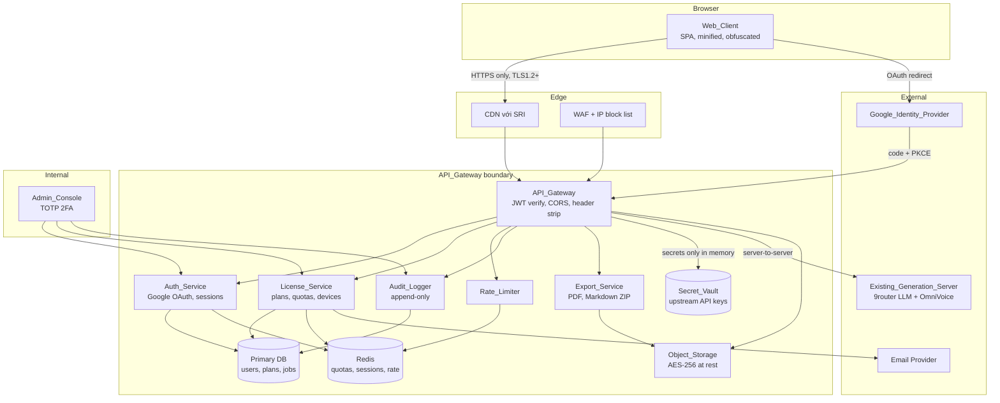
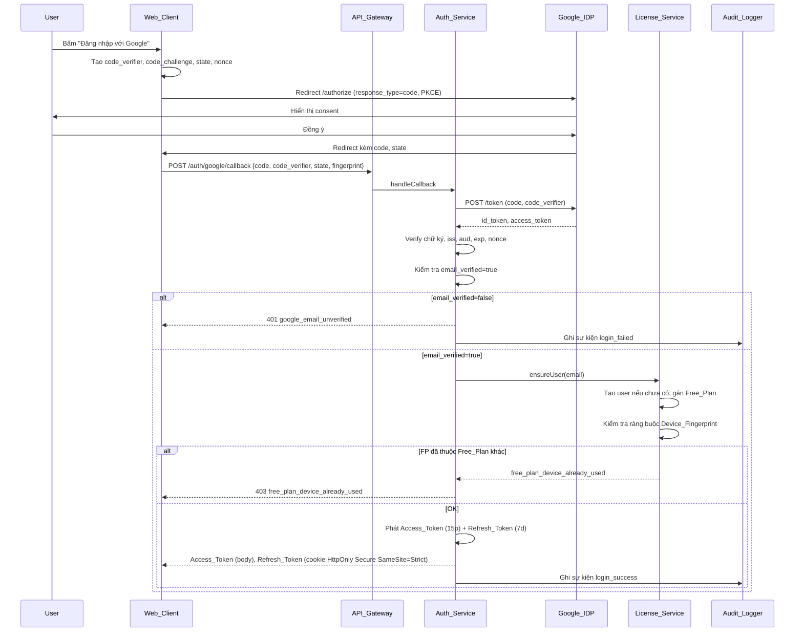
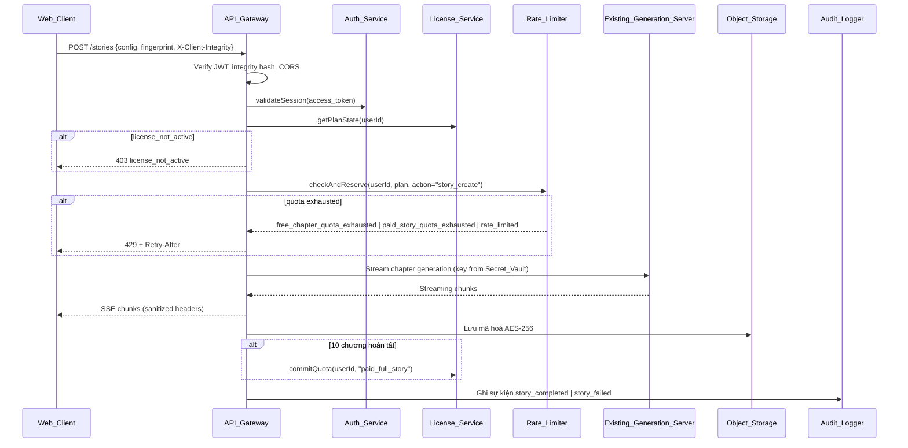
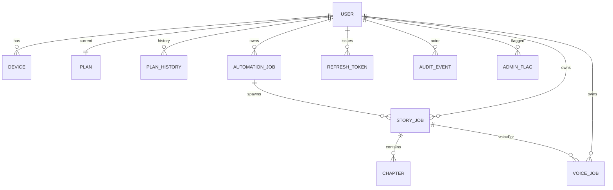

# Design Document

## Overview

Tài liệu này mô tả thiết kế kỹ thuật cho phiên bản Web thương mại hóa (SaaS) của Drama15 Lite Studio. Mục tiêu của thiết kế là đạt feature parity với bản desktop hiện tại (sáng tác truyện 10 chương, story bible, kế hoạch chương, rewrite, history, export Markdown/PDF, gen voice 10 chương qua OmniVoice) trong khi:

- Chỉ cho phép đăng nhập qua Google OAuth 2.0 Authorization Code with PKCE (phase 1).
- Phục vụ hai gói license rõ ràng: `Free_Plan` (mặc định, theo cặp `(email, Device_Fingerprint)`) và `Paid_Plan` (thuê bao 30 ngày, nâng cấp thủ công qua `Admin_Console`).
- Đẩy toàn bộ logic xác thực license, áp quota, gọi router LLM và OmniVoice ra phía backend (`API_Gateway`) để API key không rời server.
- Tăng tối đa chi phí cho việc crack, share license, hoặc trích xuất API key thông qua tổ hợp: token ngắn hạn + xoay vòng refresh token, ràng buộc thiết bị, Subresource Integrity, Content Security Policy, X-Client-Integrity, watermark export, và audit log dạng append-only.

Phạm vi phase 1 gồm 19 nhóm yêu cầu từ requirements.md. Tích hợp cổng thanh toán self-service, hoá đơn điện tử và refund nằm ngoài phạm vi (Requirement 2.9) và sẽ được bổ sung ở phase 2.

### Mục tiêu thiết kế

1. **Server-authoritative**: Mọi quyết định về license, quota, plan, role được lấy từ `License_Service` ở mỗi yêu cầu, không tin client (Requirement 3.4).
2. **Defence-in-depth**: Khó khai thác ngay cả khi client bị reverse engineer hoàn toàn (Requirement 13).
3. **Feature parity**: Trải nghiệm sáng tác bằng web phải tương đương desktop (Requirements 6, 7, 8, 9, 10, 11).
4. **Quan sát được**: Mọi sự kiện bảo mật và quota đều được audit log (Requirement 14).
5. **Không tự ý triển khai self-service billing** (Requirement 2.9).

### Phạm vi không thuộc thiết kế này

- Cổng thanh toán self-service, hoá đơn, refund.
- Mobile native app (chỉ web responsive ở chiều rộng < 768px theo Requirement 18.3).
- Đa OAuth provider (chỉ Google ở phase 1 theo Requirement 1.1).

## Architecture

### Sơ đồ thành phần tổng thể



`Web_Client` không bao giờ gọi trực tiếp `Existing_Generation_Server` (Requirement 12.1, 12.2). `API_Gateway` là biên trust duy nhất tiếp xúc với upstream và secret vault.

### Luồng đăng nhập (Google OAuth + PKCE)



### Luồng tạo Story_Job



### Phân vùng trust

| Layer | Trust giả định | Hệ quả thiết kế |
|---|---|---|
| Browser & Web_Client | Không tin (luôn coi là có thể bị tamper) | Mọi quyết định business chạy ở backend; không lưu Refresh_Token ở storage; obfuscate, SRI, CSP, integrity hash. |
| API_Gateway | Tin một phần | Là biên trust; verify JWT, kiểm license, rate-limit, sanitize header upstream. |
| License_Service / Auth_Service | Tin | Lưu user, plan, device. Không lộ ra ngoài. |
| Object_Storage | Tin | AES-256 at rest, signed URL ≤ 60 phút. |
| Existing_Generation_Server | Tin (hạ tầng nội bộ) | Chỉ được gọi từ API_Gateway bằng credential trong Secret_Vault. |
| Admin_Console | Tin sau TOTP | Truy cập có audit. |

### Lựa chọn công nghệ

- **Frontend**: SPA bằng React/Vite (TypeScript), build minified + obfuscated, SRI cho script/style bên thứ ba, CSP nghiêm.
- **Backend**: Node.js (Fastify hoặc NestJS) bằng TypeScript trùng ngôn ngữ với codebase desktop hiện có (`tsx`, `typescript`).
- **DB chính**: PostgreSQL (transactions, JSON cho metadata).
- **Cache & quota counters**: Redis (atomic counters, TTL theo cửa sổ UTC và chu kỳ Paid).
- **Storage**: S3-compatible (MinIO trên on-prem hoặc S3) với SSE-KMS AES-256 và signed URL.
- **Secret vault**: HashiCorp Vault hoặc cloud KMS cho upstream API keys.
- **Email**: SES hoặc tương đương cho thông báo hết hạn / breach.
- **Đăng nhập**: Google Identity Services (`openid email profile`) + PKCE.
- **Observability**: structured logs JSON, metrics Prometheus, append-only log sink (S3 object-lock hoặc immutable index).

## Components and Interfaces

### Web_Client

Trách nhiệm:
- Render giao diện sáng tác/voice/automation, đa ngôn ngữ Việt/Anh (Requirement 19), responsive < 768px (Requirement 18.3).
- Quản lý vòng đời Access_Token trong memory (Requirement 13.8).
- Tính `Device_Fingerprint` (kết hợp UA, platform, screen, timezone, hardwareConcurrency, hashed) và gửi kèm khi đăng nhập (Requirement 4.1).
- Gửi header `X-Client-Integrity = sha256(buildArtifact)` (Requirement 13.3).
- Phát hiện DevTools mở (heuristic) và ghi sự kiện qua `Audit_Logger` (Requirement 13.9).
- Chặn trình duyệt thiếu ECMAScript 2022 (Requirement 18.2).

Module chính:
- `auth/`: PKCE flow, refresh loop, logout.
- `stories/`: form thiết lập, tab Tổng Quan / Kế Hoạch / Chương, streaming UI (SSE), nút Tiếp tục từ chương còn thiếu.
- `rewrite/`: panel chế độ rewrite.
- `automation/`: panel cấu hình, tiến độ từng truyện, Pause/Resume/Stop/Retry.
- `voice/`: panel Voice ID, tốc độ, pitch, Pause/Stop/Resume/Retry.
- `history/`: list, view, delete.
- `export/`: tải Markdown ZIP, sinh PDF qua API.
- `account/`: thiết lập ngôn ngữ, danh sách thiết bị (Requirement 4.6, 4.7).
- `i18n/`: catalog Việt/Anh, tách biệt với output language (Requirement 19.3).

Public API client gọi (ví dụ): `POST /auth/google/start`, `POST /auth/google/callback`, `POST /auth/refresh`, `POST /auth/logout`, `GET /me`, `GET /me/devices`, `DELETE /me/devices/:fingerprint`, `POST /stories`, `POST /stories/:id/chapter`, `POST /stories/:id/resume`, `POST /stories/:id/rewrite`, `GET /stories`, `GET /stories/:id`, `DELETE /stories/:id`, `POST /automation`, `POST /automation/:id/pause|resume|stop|retry/:storyIndex`, `GET /voices`, `POST /stories/:id/voice`, `POST /voice-jobs/:id/pause|resume|stop|retry`, `POST /export/pdf`, `GET /export/markdown/:id`.

### API_Gateway

Trách nhiệm:
- Là điểm vào duy nhất từ Web_Client (Requirement 12.1).
- HTTPS bắt buộc, TLS ≥ 1.2 (Requirement 12.7); chuyển hướng HTTP → HTTPS bị từ chối ở edge.
- CORS allowlist origin Web_Client (Requirement 12.6).
- Kiểm Access_Token (signature, exp, kid), Device_Fingerprint khớp session, X-Client-Integrity nằm trong build allowlist (Requirements 3.1, 13.3, 13.4).
- Gọi `License_Service` lấy `plan_state` cho mọi request đặc quyền (Requirement 3.2). Không đọc field plan/quota/role từ body/header client (Requirement 3.4).
- Gọi `Rate_Limiter` để reserve quota, xử lý 429 + `Retry-After` (Requirement 5.9).
- Forward request tới upstream với credential lấy từ `Secret_Vault`; chỉ giải mã trong RAM (Requirement 12.3); strip header `server`, `via`, `x-powered-by`, `x-router-*` (Requirement 12.4); chuẩn hóa error chứa host/path nội bộ (Requirement 12.5).
- Apply timeout 60s upstream → trả `upstream_timeout` (Requirement 17.5).
- Phát SSE streaming cho Story_Job (Requirement 6.8, 17.3).

Interface nội bộ chính:
```ts
interface AccessTokenClaims {
  sub: string;          // userId
  email: string;
  fp: string;           // Device_Fingerprint hash
  sid: string;          // session id
  plan: 'unknown';      // KHÔNG gồm plan thật; client không được tin
  iat: number;
  exp: number;          // <= iat + 15 phút
  kid: string;
}

interface PlanState {
  userId: string;
  plan: 'Free_Plan' | 'Paid_Plan';
  status: 'active' | 'expired' | 'revoked' | 'pending_deletion';
  paidStartAt?: string; // ISO
  paidExpireAt?: string;
}

interface QuotaDecision {
  allowed: boolean;
  errorCode?:
    | 'free_chapter_quota_exhausted'
    | 'paid_story_quota_exhausted'
    | 'paid_voice_quota_exhausted'
    | 'rewrite_quota_exhausted'
    | 'rate_limited';
  retryAfterSeconds?: number;
  resetAt?: string;
  remaining?: number;
}
```

### Auth_Service

Trách nhiệm:
- Hỗ trợ duy nhất Google OAuth 2.0 Authorization Code + PKCE (Requirement 1.1, 1.2).
- Đổi authorization code → ID token; verify chữ ký, `iss`, `aud`, `exp`, `nonce`; chỉ chấp nhận `email_verified = true` (Requirements 1.3, 1.4).
- Tạo tài khoản mới khi email lần đầu xuất hiện, gán Free_Plan, phát hành Access_Token (15 phút) + Refresh_Token (7 ngày) (Requirement 1.5).
- Đăng nhập lại: phát hành cặp token mới (Requirement 1.6).
- Refresh: refresh token rotation, vô hiệu refresh cũ ngay khi cấp refresh mới (Requirement 1.7); reuse → tất cả refresh trong family bị thu hồi.
- Refresh token hết hạn/bị thu hồi → trả `refresh_token_invalid` (Requirement 1.8).
- Logout: thu hồi refresh hiện tại + xoá cookie (Requirement 1.9).
- Gắn `Device_Fingerprint` vào session, kiểm xác thực phía server (Requirement 4.1).
- Cho phép tối đa 1 FP đồng thời cho Free_Plan, 3 cho Paid_Plan (Requirement 4.2, 4.3); vượt → `device_limit_reached` (Requirement 4.4).
- Theo dõi `last_seen` mỗi FP, expose API danh sách thiết bị (Requirement 4.6).
- Đăng xuất 1 thiết bị → revoke refresh trong ≤ 60s (Requirement 4.7).
- Phát hiện chuyển quốc gia IP trong 10 phút → yêu cầu reauth Google (Requirement 4.5).

Refresh token được lưu hashed (sha256) trong DB, kèm `family_id`, `parent_id`, `revoked_at`. Cookie chứa giá trị nguyên (HttpOnly, Secure, SameSite=Strict, Path=/auth, Max-Age 7d) (Requirements 13.6, 13.7).

### License_Service

Trách nhiệm:
- Quản lý hai plan duy nhất Free_Plan và Paid_Plan (Requirement 2.1).
- Khi tạo user mới, tự gán Free_Plan, không expire (Requirement 2.2).
- Đảm bảo unique (Free_Plan đang active) trên mỗi Device_Fingerprint (Requirement 2.3, 2.4).
- Nâng cấp Paid: bắt đầu = now, expire = now + 30d (Requirements 2.5, 16.3).
- Notify email khi Paid còn ≤ 72h (Requirement 2.6).
- Background job mỗi phút quét Paid hết hạn → set `expired`, đưa user về Free_Plan (Requirement 2.7).
- Revoke Paid: set `revoked`, về Free_Plan, vô hiệu hoá tất cả Access_Token + Refresh_Token gắn user trong ≤ 60s (Requirement 2.8, 16.4).
- Không thực hiện billing/refund (Requirement 2.9).
- API tính/trừ quota (story full, voice, rewrite, chapter Free) (Requirements 5.2–5.7, 5.10, 6.5, 8.5, 9.5).
- Khi Paid được gia hạn (renew sang chu kỳ mới): khôi phục quota về 20/20 (Requirement 5.10).
- Reset user về Free_Plan khi Paid hết hạn (Requirement 2.7).
- Flag user khi `client_integrity_failed` > 50 trong 24h (Requirement 14.4).
- Xoá user pending: ẩn dữ liệu, xoá PII + truyện trong ≤ 30 ngày (Requirement 15.3).
- Gửi notification trong 72h khi sự cố lộ PII (Requirement 15.5).

### Rate_Limiter

Trách nhiệm:
- Cap 60 request/phút trên endpoint tạo truyện và rewrite (Requirement 5.1).
- Free_Plan: 3 chương / cửa sổ 24h UTC (00:00–23:59:59) (Requirement 5.2, 5.3).
- Paid_Plan: 20 truyện full / chu kỳ 30d, 20 voice / chu kỳ 30d (Requirements 5.4–5.7).
- Concurrent Story_Job: 1 cho Free, 10 cho Paid (Requirement 5.8).
- Vượt rate → `rate_limited` + `Retry-After` (Requirement 5.9).
- Cap 30 rewrite/24h UTC mỗi user (Requirement 7.4); vượt → `rewrite_quota_exhausted` (Requirement 7.6).
- Không đếm rewrite vào quota chương Free / quota truyện Paid (Requirement 7.5).
- Reservation pattern: trừ trước khi gọi upstream, commit khi hoàn tất, rollback khi fail/retry (Requirement 6.9, 7.7, 8.7, 9.9 đều không trừ thêm cho retry).

Triển khai bằng Redis: counters keyed theo user, cửa sổ và chu kỳ.
- `quota:free:chapter:{userId}:{utcDate}` (TTL hết ngày UTC).
- `quota:paid:story:{userId}:{cycleId}` (TTL hết chu kỳ Paid).
- `quota:paid:voice:{userId}:{cycleId}` (TTL hết chu kỳ Paid).
- `quota:rewrite:{userId}:{utcDate}` (TTL hết ngày UTC).
- `rate:rpm:{userId}` (sliding 60s).
- `concurrency:story:{userId}` (set TTL = 24h).

### Existing_Generation_Server (proxy target)

API_Gateway gọi:
- `POST /story/setup-suggest` (tự tạo niche/title/seed).
- `POST /story/full-stream` (10 chương SSE).
- `POST /story/chapter` (1 chương).
- `POST /story/rewrite` (rewrite).
- `GET /tts/voices`.
- `POST /tts/chapter` (per chapter).

Tất cả gọi qua HTTPS server-to-server bằng credential vault (Requirement 12.3, 9.6). Web_Client tuyệt đối không thấy host hoặc credential này (Requirement 9.10, 12.4, 12.5).

### Export_Service

Trách nhiệm:
- Sinh PDF cả truyện kèm watermark email + storyId trong footer mỗi trang (Requirement 11.3).
- Đóng gói Markdown ZIP với mỗi file có comment ẩn `<!-- Drama15Lite SaaS export | account: <email> | storyId: <id> -->` cuối file (Requirement 11.4).
- Trả URL có chữ ký, TTL ≤ 60 phút (Requirements 11.2, 9.8).

### Admin_Console

Trách nhiệm (Requirement 16):
- Đăng nhập tài khoản role `admin` đã bật TOTP (Requirement 16.1).
- Tra cứu theo email/id/Device_Fingerprint (Requirement 16.2).
- Nâng cấp/Thu hồi Paid_Plan (Requirements 16.3, 16.4).
- Bảng tài khoản bị flag `client_integrity_failed` (Requirement 16.5).
- Xem audit log có lọc (Requirement 16.6).
- Mọi hành động admin được ghi audit kèm `actor_admin_id` (Requirement 16.7).

### Audit_Logger

Trách nhiệm (Requirement 14):
- Ghi: login_success, login_failed, logout, free_plan_granted, paid_plan_upgraded, paid_plan_expired, paid_plan_revoked, access_token_issued, access_token_rejected, license_or_quota_denied, client_integrity_failed, devtools_detected, admin_action.
- Kèm `userId, fingerprint, ip, browserLocale, utcTimestamp` (Requirement 14.2).
- Trên 100 login_failed/giờ từ 1 dải IP → block 24h (Requirement 14.3).
- Lưu append-only ≥ 365 ngày, không cho sửa tại chỗ (Requirement 14.5).
- Không bao giờ log Access_Token, Refresh_Token, hay OAuth code nguyên dạng (Requirement 15.4) — chỉ log hash sha256 truncated.

Triển khai: Postgres `audit_events` (insert-only, RLS từ chối UPDATE/DELETE) + sao lưu sang object store có object-lock.

## Data Models

### Database schema (logic)



### Bảng chính

**users**
| Trường | Kiểu | Ghi chú |
|---|---|---|
| id | uuid PK | |
| email | citext UNIQUE | primary identifier (Requirement 1.3) |
| google_sub | text UNIQUE | Google `sub` |
| display_name | text | từ ID token |
| status | enum | `active`, `pending_deletion`, `deleted` |
| ui_locale | enum | `vi`, `en` (Requirement 19) |
| created_at, updated_at | timestamptz | |

**plans** (current plan của user)
| Trường | Kiểu | Ghi chú |
|---|---|---|
| user_id | uuid PK FK users | |
| plan | enum | `Free_Plan` \| `Paid_Plan` |
| status | enum | `active`, `expired`, `revoked` |
| paid_start_at | timestamptz | null nếu Free_Plan |
| paid_expire_at | timestamptz | null nếu Free_Plan |
| paid_cycle_id | uuid | đổi mỗi lần Paid được phát hành mới (để keying quota) |
| free_chapter_quota_used | smallint | reset 00:00 UTC; được duy trì ở Redis, mirror DB cho durability |
| paid_story_quota_used | smallint | 0..20 |
| paid_voice_quota_used | smallint | 0..20 |
| flagged_for_review | boolean | default false |

Constraint: nếu `plan = Free_Plan` thì `paid_start_at` và `paid_expire_at` IS NULL. Nếu `plan = Paid_Plan` thì cả hai NOT NULL và `paid_expire_at = paid_start_at + 30 days`.

**plan_history** (append-only)
| Trường | Kiểu | Ghi chú |
|---|---|---|
| id | uuid PK | |
| user_id | uuid FK | |
| from_plan, to_plan | enum | |
| reason | enum | `auto_assign`, `admin_upgrade`, `admin_revoke`, `expired`, `renewed` |
| at | timestamptz | |
| actor_admin_id | uuid NULL | |

**devices**
| Trường | Kiểu | Ghi chú |
|---|---|---|
| user_id | uuid FK | |
| fingerprint | text | hash từ client |
| first_seen, last_seen | timestamptz | |
| last_ip | inet | |
| last_country | text | dùng cho rule 4.5 |
| status | enum | `active`, `revoked` |
| PRIMARY KEY (user_id, fingerprint) | | |

Index: `UNIQUE (fingerprint) WHERE status='active' AND user.plan='Free_Plan'` được thực hiện ở App layer (PostgreSQL partial unique trên view) để bảo đảm Requirement 2.3.

**refresh_tokens**
| Trường | Kiểu | Ghi chú |
|---|---|---|
| id | uuid PK | |
| user_id | uuid FK | |
| family_id | uuid | rotation family |
| parent_id | uuid NULL | |
| token_hash | text | sha256 |
| device_fingerprint | text | |
| issued_at, expires_at | timestamptz | exp = issued_at + 7d |
| revoked_at | timestamptz NULL | |
| revoke_reason | enum | `rotated`, `logout`, `device_remove`, `paid_revoked`, `family_compromised` |

**access_tokens** không lưu DB; nhưng `kid` của khóa ký được lưu, và khi cần “vô hiệu hóa toàn bộ Access_Token gắn user trong 60s” (Requirement 2.8) chúng ta dùng cờ `users.token_epoch` (bigint) đính vào claim `epoch`; Gateway kiểm `claim.epoch == users.token_epoch` (cache 60s).

**story_jobs**
| Trường | Kiểu | Ghi chú |
|---|---|---|
| id | uuid PK | |
| user_id | uuid FK | |
| status | enum | `running`, `paused`, `completed`, `failed`, `partial` |
| niche, language, config | jsonb | |
| created_at, updated_at, completed_at | timestamptz | |
| automation_job_id | uuid NULL | |
| quota_charged | boolean | true khi đã trừ quota truyện full |

**chapters**
| Trường | Kiểu | Ghi chú |
|---|---|---|
| story_id | uuid FK | |
| index | smallint | 1..10 |
| status | enum | `pending`, `streaming`, `done`, `failed` |
| content_ref | text | object key trong storage |
| created_at, updated_at | timestamptz | |
| PK (story_id, index) | | |

**voice_jobs**
| Trường | Kiểu | Ghi chú |
|---|---|---|
| id | uuid PK | |
| story_id | uuid FK | |
| voice_id | text | |
| speed, pitch | numeric | |
| status | enum | `running`, `paused`, `completed`, `failed`, `partial` |
| chapters_completed | smallint | 0..10 |
| quota_charged | boolean | |

**automation_jobs**
| Trường | Kiểu | Ghi chú |
|---|---|---|
| id | uuid PK | |
| user_id | uuid FK | |
| target_count | smallint | luôn ≤ 2 (Requirement 8.3) |
| status | enum | `running`, `paused`, `completed`, `failed` |
| created_at | timestamptz | |

**audit_events** (append-only; UPDATE/DELETE bị từ chối qua RLS)
| Trường | Kiểu | Ghi chú |
|---|---|---|
| id | bigserial PK | |
| ts | timestamptz | UTC |
| user_id | uuid NULL | |
| fingerprint | text NULL | |
| ip | inet | |
| browser_locale | text | |
| event_type | text | enum mở rộng |
| details | jsonb | KHÔNG chứa token nguyên dạng |

**admin_flags**
| Trường | Kiểu | Ghi chú |
|---|---|---|
| user_id | uuid FK | |
| reason | enum | `client_integrity_failed_threshold` |
| created_at | timestamptz | |
| cleared_at | timestamptz NULL | |
| actor_admin_id | uuid NULL | |

### Token format

Access_Token (JWT, RS256):
```json
{
  "iss": "https://api.drama15.example",
  "sub": "<userId>",
  "email": "<email>",
  "fp": "<fingerprint-hash>",
  "sid": "<sessionId>",
  "epoch": 42,
  "iat": 1730000000,
  "exp": 1730000900,
  "kid": "auth-2026-01"
}
```
Không chứa plan/quota/role (Requirement 3.4).

Refresh_Token: 256-bit ngẫu nhiên, base64url; chỉ tồn tại trong cookie HttpOnly Secure SameSite=Strict (Requirement 13.7); DB lưu hash.

### Quota counter semantics

| Plan | Counter | Window | Cap | Tăng khi | Hoàn lại khi |
|---|---|---|---|---|---|
| Free | chapter | UTC date | 3 | một chương được tạo (kể cả chương lẻ) | reset 00:00 UTC ngày sau (Requirement 5.3) |
| Paid | story_full | 30d cycle | 20 | 1 story_job hoàn tất 10 chương | reset khi Paid renew (Requirement 5.10) |
| Paid | voice | 30d cycle | 20 | 1 voice_job hoàn tất 10 chương | reset khi Paid renew |
| Mọi plan | rewrite | UTC date | 30 | mỗi rewrite request được nhận | reset 00:00 UTC ngày sau |

Retry không trừ thêm (Requirement 6.9, 7.7, 8.7, 9.9): job có cờ `quota_charged`; chỉ commit khi hoàn tất, retry không gọi commit lần hai.

### Cấu hình ngôn ngữ

`users.ui_locale ∈ {vi, en}` (Requirement 19.1, 19.2). Mỗi yêu cầu sáng tác chứa `outputLanguage` riêng (Requirement 6.12, 19.3).

## Correctness Properties


*A property is a characteristic or behavior that should hold true across all valid executions of a system — essentially, a formal statement about what the system should do. Properties serve as the bridge between human-readable specifications and machine-verifiable correctness guarantees.*

Các property dưới đây được rút ra từ pre-work phân tích từng acceptance criterion. Các nhóm trùng lặp đã được gộp lại để mỗi property mang giá trị xác minh độc lập.

### Property 1: Plan state-machine luôn hợp lệ

*For all* user và mọi sequence hợp lệ của các thao tác (`signup`, `admin_upgrade`, `admin_revoke`, `paid_expire`, `paid_renew`), tại mọi thời điểm: `plan ∈ {Free_Plan, Paid_Plan}`; nếu `plan = Paid_Plan ∧ status = active` thì `paid_expire_at = paid_start_at + 30 ngày`; sau bất kỳ thao tác `revoke` hoặc `expire` user phải ở `Free_Plan` đang active; sau `paid_renew`, các counter `paid_story_quota_used` và `paid_voice_quota_used` đều bằng 0.

**Validates: Requirements 2.1, 2.2, 2.5, 2.7, 2.8, 5.10, 16.3, 16.4**

### Property 2: Refresh-token rotation và thu hồi đúng đắn

*For all* sequence các thao tác `(issue, refresh, logout, device_remove, paid_revoke)` trên một family refresh token, một refresh token chỉ hợp lệ khi đồng thời: chưa hết hạn (`now < expires_at`), chưa bị `revoked_at`, và family chưa bị đánh dấu compromised; nếu một refresh token đã được rotate (đã có con) lại được trình lại, thì toàn bộ family bị thu hồi và tất cả refresh token cùng family đều trở nên không hợp lệ.

**Validates: Requirements 1.7, 1.8, 1.9, 2.8, 4.7**

### Property 3: Token TTL bounds

*For all* lần phát hành token: `Access_Token` có `exp − iat ≤ 900 s` và `Refresh_Token` có `exp − iat = 7 ngày`. Web_Client gọi refresh khi và chỉ khi access hiện tại đã hết hạn hoặc sẽ hết trong an toàn margin.

**Validates: Requirements 1.5, 1.6, 3.5, 3.6**

### Property 4: ID token verification

*For all* response từ Google_Identity_Provider, `Auth_Service` chấp nhận khi và chỉ khi: chữ ký RS256 hợp lệ với JWKS hiện hành, `iss == https://accounts.google.com` (hoặc giá trị Google công bố), `aud` khớp client id, `now < exp`, `nonce` khớp giá trị đã phát, và `email_verified == true`; nếu `email_verified == false` thì lỗi trả về phải là `google_email_unverified`.

**Validates: Requirements 1.3, 1.4**

### Property 5: Quota counters tôn trọng cap, window và idempotence

*For all* `(plan, action ∈ {free_chapter, paid_full_story, paid_voice, rewrite})` với cap và window tương ứng, sau khi N action đã hoàn tất trong cùng window (`N = cap`), action thứ `N+1` trong cùng window phải bị từ chối với đúng mã lỗi `free_chapter_quota_exhausted` / `paid_story_quota_exhausted` / `paid_voice_quota_exhausted` / `rewrite_quota_exhausted` và thông tin reset (`Retry-After` hoặc `resetAt = 00:00 UTC ngày kế tiếp` hoặc `paid_expire_at`); retry một action đã in-flight (Story_Job hoặc Voice_Job partial, retry sub-story Automation, retry chương voice) không làm tăng counter; rewrite không bao giờ làm thay đổi counter `free_chapter` hoặc `paid_full_story`.

**Validates: Requirements 5.2, 5.3, 5.4, 5.5, 5.6, 5.7, 6.3, 6.5, 6.9, 7.4, 7.5, 7.6, 8.4, 8.5, 8.7, 9.5, 9.9**

### Property 6: Concurrency cap cho Story_Job

*For all* user và mọi sequence `(start_job, finish_job, fail_job)`, số Story_Job đang ở trạng thái `running` của user không bao giờ vượt 1 nếu `plan = Free_Plan` và không vượt 10 nếu `plan = Paid_Plan`; mọi yêu cầu vượt cap bị từ chối với `rate_limited` (kèm `Retry-After`).

**Validates: Requirements 5.8, 5.9**

### Property 7: Rate limit 60 req/phút

*For all* sequence request tới endpoint tạo truyện hoặc rewrite của một user trong cửa sổ trượt 60 giây, số request được chấp nhận ≤ 60; mọi request vượt phải trả `rate_limited` với header `Retry-After` ≥ 1 giây.

**Validates: Requirements 5.1, 5.9**

### Property 8: Device-fingerprint constraints theo plan

*For all* user và sequence `(login(fp), logout(fp), device_remove(fp))`: số session active đồng thời ≤ 1 nếu `plan = Free_Plan` và ≤ 3 nếu `plan = Paid_Plan`; vượt cap → `device_limit_reached`; nếu một fingerprint đã liên kết với một Free_Plan đang active, một user khác cố gắng login Free_Plan từ cùng fingerprint phải bị từ chối với `free_plan_device_already_used`.

**Validates: Requirements 2.3, 2.4, 4.2, 4.3, 4.4**

### Property 9: Reauth khi đổi quốc gia IP

*For all* phiên active, nếu Access_Token được sử dụng từ địa chỉ IP có mã quốc gia khác với mã quốc gia gắn với phiên trong khoảng thời gian ≤ 10 phút từ lần verify trước, request phải bị API_Gateway từ chối với yêu cầu reauth Google trước khi cho phép tiếp tục.

**Validates: Requirements 4.5**

### Property 10: Server-authoritative authorization

*For all* request HTTP, quyết định cấp/từ chối tính năng đặc quyền của API_Gateway chỉ phụ thuộc vào `(Access_Token signature, License_Service.getPlanState(userId), session.fingerprint)` và không bao giờ phụ thuộc vào field `plan`, `role` hoặc `quota` do client gửi trong body/header; truy cập tài nguyên thuộc về owner `X` chỉ được cấp cho `X` hoặc cho admin (kèm bản ghi audit), mọi truy cập khác phải trả `forbidden`.

**Validates: Requirements 3.2, 3.3, 3.4, 10.4, 15.2**

### Property 11: Reject request thiếu hoặc không hợp lệ Access_Token

*For all* request HTTP tới endpoint cần xác thực, nếu không có Access_Token, hoặc token có chữ ký sai/hết hạn/`epoch` không khớp `users.token_epoch`, API_Gateway phải trả `unauthenticated`.

**Validates: Requirements 3.1, 2.8**

### Property 12: Sanitisation upstream → response client

*For all* response upstream và mọi error message upstream chứa danh sách `(api_key, internal_host, internal_path, header server, header via, header x-powered-by, header có tiền tố x-router)`, response trả về Web_Client không chứa bất kỳ giá trị nào trong danh sách đó.

**Validates: Requirements 6.6, 9.6, 9.10, 12.2, 12.4, 12.5**

### Property 13: CORS allowlist

*For all* preflight request có header `Origin = O`, API_Gateway chỉ trả CORS headers cho phép khi `O` thuộc allowlist origin Web_Client; với mọi `O` khác phải trả response không chứa `Access-Control-Allow-Origin` (hoặc 403).

**Validates: Requirements 12.6**

### Property 14: SRI và CSP

*For all* tài nguyên `<script>` hoặc `<link rel=stylesheet>` cross-origin trong HTML build production, phần tử có thuộc tính `integrity` chứa hash sha256/384/512 hợp lệ; *for all* origin cố nạp script/style không thuộc `{self, API_Gateway, Google_Identity_Provider}`, header CSP của Web_Client phải khiến trình duyệt block tài nguyên đó.

**Validates: Requirements 13.2, 13.5**

### Property 15: X-Client-Integrity check

*For all* request từ Web_Client tới API_Gateway, request có header `X-Client-Integrity = h`; API_Gateway chấp nhận khi và chỉ khi `h` thuộc danh sách build hash hợp lệ. Nếu không hợp lệ, response là `client_integrity_failed`.

**Validates: Requirements 13.3, 13.4**

### Property 16: Token storage tách biệt

*For all* lần phát hành Access_Token và Refresh_Token trên Web_Client, không có lệnh `localStorage.setItem` hay `sessionStorage.setItem` nào nhận giá trị token; Refresh_Token chỉ xuất hiện trong header `Set-Cookie` với đầy đủ `HttpOnly; Secure; SameSite=Strict`; Access_Token chỉ tồn tại trong biến runtime của Web_Client.

**Validates: Requirements 13.6, 13.7, 13.8**

### Property 17: Signed URL TTL

*For all* signed URL được API_Gateway phát hành cho Web_Client để tải file PDF, ZIP Markdown, hoặc voice asset, `expires_at − now ≤ 60 phút`, và path/object key chỉ trỏ tới resource thuộc user đang yêu cầu.

**Validates: Requirements 9.8, 11.2**

### Property 18: Watermark trong export

*For all* export Markdown của một story, mỗi file `.md` chứa đúng một dòng comment ẩn ở cuối ghi `email` của owner và `storyId`; *for all* export PDF của một story, mỗi trang chứa footer hiển thị đồng thời `email` của owner và `storyId`.

**Validates: Requirements 11.3, 11.4**

### Property 19: History list ordering và scope

*For all* user, danh sách Story_Job trả về cho user đó được sắp xếp giảm dần theo `created_at` và chỉ chứa các job có `user_id = userId`; truy vấn một Story_Job thuộc owner khác trả `forbidden`.

**Validates: Requirements 10.1, 10.4**

### Property 20: Resume chỉ sinh chương còn thiếu

*For all* Story_Job có chương ở trạng thái `done` ⊆ {1..10}, sau khi bấm Resume / Tiếp tục, hệ thống chỉ sinh các chương có index thuộc `{1..10} ∖ done`; counter quota không tăng trong giai đoạn resume; chỉ commit quota khi job đạt đủ 10 chương đầu tiên (idempotent với mọi lần resume tiếp theo).

**Validates: Requirements 6.9, 7.7**

### Property 21: Audit log completeness, schema, append-only và safety

*For all* sự kiện loại bắt buộc trong Requirement 14.1 (login_success/failed, logout, free_plan_granted, paid_plan_upgraded/expired/revoked, access_token_issued/rejected, license_or_quota_denied, client_integrity_failed, admin_action), Audit_Logger ghi đúng một bản ghi với các trường `(userId, fingerprint, ip, browser_locale, ts_utc)` không null khi có ngữ cảnh, `details` không chứa Access_Token / Refresh_Token / OAuth code nguyên dạng; UPDATE và DELETE trên bảng `audit_events` phải thất bại; mọi hành động admin có `actor_admin_id` không null trong audit row.

**Validates: Requirements 14.1, 14.2, 14.5, 15.4, 16.7**

### Property 22: IP block sau 100 login fail/giờ

*For all* dải IP có hơn 100 login_failed trong cửa sổ 60 phút, dải IP đó nằm trong block list trong 24 giờ và mọi request từ dải đó tới API_Gateway bị từ chối; sau 24 giờ, block list không còn entry đó.

**Validates: Requirements 14.3**

### Property 23: Flag user vượt ngưỡng integrity

*For all* user có hơn 50 sự kiện `client_integrity_failed` trong cửa sổ 24 giờ, License_Service đặt `flagged_for_review = true` cho user đó.

**Validates: Requirements 14.4**

### Property 24: PII deletion timeline

*For all* yêu cầu xoá tài khoản, sau khi user chuyển trạng thái `pending_deletion`: dữ liệu PII (email, display_name, ip lịch sử) và dữ liệu truyện không còn truy được qua API trong vòng tối đa 30 ngày tính từ thời điểm yêu cầu.

**Validates: Requirements 15.3**

### Property 25: PII breach notification timeline

*For all* incident được xác nhận làm lộ PII, License_Service phát thông báo tới mọi user bị ảnh hưởng trong vòng ≤ 72 giờ kể từ thời điểm xác nhận.

**Validates: Requirements 15.5**

### Property 26: Output language pass-through và độc lập với UI locale

*For all* request sáng tác có `outputLanguage = L` và user có `ui_locale = U`, request gửi tới Existing_Generation_Server có cùng `outputLanguage = L` bất kể giá trị `U`; *for all* user lưu `ui_locale = U`, lần tải kế tiếp giao diện hiển thị bằng ngôn ngữ `U`.

**Validates: Requirements 6.12, 19.2, 19.3**

### Property 27: Upstream timeout

*For all* upstream call vượt 60 giây không có response, API_Gateway huỷ kết nối thượng nguồn và trả `upstream_timeout` cho Web_Client.

**Validates: Requirements 17.5**

### Property 28: Automation cap và prerequisites

*For all* yêu cầu khởi tạo Automation_Job: nếu `plan = Free_Plan` thì bị từ chối với `automation_requires_paid`; nếu `target_count > 2` thì bị từ chối; nếu `paid_story_quota_used + target_count > 20` thì bị từ chối với `paid_story_quota_exhausted`; ngoài ra job được chấp nhận và mỗi truyện trong job khi hoàn tất 10 chương trừ đúng 1 quota.

**Validates: Requirements 8.2, 8.3, 8.4, 8.5, 9.2, 2.10**

### Property 29: Voice precondition

*For all* yêu cầu khởi tạo Voice_Job: chấp nhận khi và chỉ khi `plan = Paid_Plan ∧ story.completed_chapters = 10`; ngược lại trả `voice_requires_paid` (nếu Free) hoặc lỗi precondition (nếu chưa đủ 10 chương).

**Validates: Requirements 9.2, 9.4, 2.10**

### Property 30: Job FSM hợp lệ (Story / Voice / Automation)

*For all* sequence chuyển trạng thái `(start, pause, resume, stop, fail, complete, retry)` áp dụng cho Story_Job / Voice_Job / Automation_Job, tập trạng thái đạt được chỉ thuộc các transition hợp lệ của FSM tương ứng, không có concurrent transition mâu thuẫn, và counters quota đồng nhất với Property 5.

**Validates: Requirements 8.6, 9.7**

### Property 31: ES2022 guard

*For all* user agent thiếu hỗ trợ ECMAScript 2022 (ví dụ thiếu `Object.hasOwn` / class fields / top-level await), Web_Client hiển thị thông báo nâng cấp và không khởi tạo SPA chính.

**Validates: Requirements 18.2**

### Property 32: Admin TOTP gating

*For all* lần đăng nhập tài khoản role `admin`, đăng nhập chỉ được phép nếu cung cấp đúng mã TOTP hiện hành; thiếu TOTP hoặc TOTP sai → reject.

**Validates: Requirements 16.1**

## Error Handling

### Mã lỗi chuẩn (mọi response đều dùng JSON `{ error: { code, message, retryAfterSeconds?, resetAt? } }`):

| Mã | HTTP | Nguồn |
|---|---|---|
| `unauthenticated` | 401 | Thiếu/sai Access_Token (Req 3.1) |
| `refresh_token_invalid` | 401 | RT hết hạn/thu hồi (Req 1.8) |
| `google_email_unverified` | 401 | email_verified=false (Req 1.4) |
| `device_limit_reached` | 403 | Vượt cap thiết bị (Req 4.4) |
| `free_plan_device_already_used` | 403 | FP trùng Free khác (Req 2.4) |
| `license_not_active` | 403 | Plan không active (Req 3.3) |
| `automation_requires_paid` | 403 | Free dùng Automation (Req 2.10, 8.2) |
| `voice_requires_paid` | 403 | Free dùng voice (Req 2.10, 9.2) |
| `forbidden` | 403 | Truy cập tài nguyên không phải owner (Req 10.4) |
| `client_integrity_failed` | 403 | Hash X-Client-Integrity không hợp lệ (Req 13.4) |
| `free_chapter_quota_exhausted` | 429 | Hết quota chương Free (Req 5.3) |
| `paid_story_quota_exhausted` | 429 | Hết quota truyện Paid (Req 5.5, 8.4) |
| `paid_voice_quota_exhausted` | 429 | Hết quota voice (Req 5.7) |
| `rewrite_quota_exhausted` | 429 | Hết quota rewrite (Req 7.6) |
| `rate_limited` | 429 | Vượt 60 req/phút hoặc concurrency (Req 5.1, 5.8, 5.9) |
| `upstream_timeout` | 504 | Upstream > 60s (Req 17.5) |
| `reauth_required` | 401 | Đổi quốc gia IP (Req 4.5) |
| `unsupported_browser` | 426 | Trình duyệt thiếu ES2022 (Req 18.2) |

### Quy tắc xử lý lỗi

- **Sanitisation upstream error**: Khi Existing_Generation_Server trả lỗi chứa hostname/path nội bộ, API_Gateway thay thế bằng template `{ code: 'upstream_error', message: 'Upstream service error', requestId }` (Requirement 12.5). `requestId` cho phép tra log nội bộ nhưng không lộ chi tiết.
- **Retry-After**: Mọi response 429 phải có header `Retry-After` ≥ 1 giây và body chứa `retryAfterSeconds` hoặc `resetAt` (ISO UTC) tuỳ loại quota (Requirement 5.9, 7.6).
- **Streaming SSE error**: Khi Story_Job/Voice_Job đang stream gặp lỗi, API_Gateway gửi event SSE `event: error\ndata: {code, message}` và đóng connection; Web_Client hiển thị nút retry/resume tương ứng (Requirement 6.9, 9.9).
- **Refresh token reuse → family compromise**: Phát hiện reuse RT đã rotated → revoke toàn family + ghi audit `refresh_token_reuse_detected` (Requirement 1.7, ngầm bảo vệ).
- **Token revocation propagation ≤ 60s**: Khi admin revoke Paid hoặc revoke device, `users.token_epoch` tăng. Cache `epoch` ở API_Gateway có TTL 30 giây để tổng latency ≤ 60 giây (Requirement 2.8, 4.7).
- **CSP / SRI vi phạm**: Trình duyệt block trực tiếp; Web_Client xử lý `securitypolicyviolation` để báo qua Audit_Logger (Requirement 13.2, 13.5).
- **Email notify fail (Req 2.6)**: Job retry với exponential backoff; nếu thất bại liên tục > 24 giờ thì gắn audit `notify_failed` để admin xử lý.

### Defensive defaults

- Bất kỳ exception ngoài danh sách → trả `internal_error` HTTP 500 với requestId; không stack trace ra client.
- Mọi response đều set `Cache-Control: no-store` cho route auth/license; SSE set `X-Accel-Buffering: no`.
- API_Gateway luôn ép `Content-Type` JSON cho non-streaming endpoint, từ chối body XML/HTML để giảm tấn công type confusion.

## Testing Strategy

Thiết kế kiểm thử áp dụng cách tiếp cận **kép**: unit test cho ví dụ cụ thể và edge case, property-based test cho các property bất biến đã liệt kê. PBT đặc biệt phù hợp cho hệ thống này vì phần lớn logic core (state-machine plan, rotation token, counter quota theo cửa sổ thời gian, FSM job, sanitisation upstream, RBAC) là logic thuần có input/output rõ ràng và universal property hợp lý.

### Phạm vi PBT vs phạm vi không PBT

PBT áp dụng cho:
- Logic License_Service (plan transitions, quota counters, device constraints).
- Logic Auth_Service (token TTL, rotation, family compromise, ID token verification).
- Logic API_Gateway (header sanitisation, CORS, X-Client-Integrity check, JWT validation, error mapping).
- Logic Rate_Limiter (cửa sổ trượt 60 req/phút, daily UTC reset, 30-day cycle counter, rewrite separate counter, concurrency cap).
- Logic Job FSM (Story/Voice/Automation transitions, idempotent retry).
- Export pipeline (watermark presence, signed URL TTL).
- Audit invariants (append-only, schema completeness, no token leak).

PBT không áp dụng cho (dùng integration / smoke / example tests):
- Cấu hình hạ tầng (TLS handshake, AES-256 storage, CSP browser-side enforcement, SSE-KMS).
- Performance (Req 17.1, 17.2, 17.3, 17.4) — đo bằng load test và Lighthouse.
- UI rendering tĩnh (Req 6.1, 6.7, 7.1, 9.1, 16.5, 16.6, 18.3) — snapshot và visual test.
- Build pipeline (Req 13.1) — smoke trên artifact.

### Công cụ và cấu hình

- Ngôn ngữ kiểm thử: TypeScript (đồng bộ với codebase desktop hiện có dùng `tsx` + `node --test`).
- Thư viện PBT: `fast-check` (không tự cài đặt PBT từ đầu).
- Mỗi property test cấu hình tối thiểu **100 iterations** (`fc.assert(..., { numRuns: 100 })`); các property nhạy cảm (token rotation, quota state machine) chạy 500 iterations.
- Mỗi property test gắn comment tag theo đúng định dạng:

  ```ts
  // Feature: commercial-web-saas, Property 1: Plan state-machine luôn hợp lệ
  ```

- Mỗi property trong design document tương ứng **một** property-based test duy nhất (1:1 mapping).
- Mock tầng I/O (Postgres, Redis, OAuth, upstream) bằng test double in-memory; PBT chỉ kiểm logic, không phụ thuộc resource ngoài.

### Bố cục thư mục đề xuất

```
tests/
  unit/                  # ví dụ cụ thể, edge cases
    auth.example.test.ts
    rate-limiter.examples.test.ts
    export.snapshot.test.ts
  property/              # PBT - 1:1 với Properties trong design
    p01-plan-fsm.test.ts
    p02-refresh-rotation.test.ts
    p03-token-ttl.test.ts
    p04-id-token-verify.test.ts
    p05-quota-counters.test.ts
    p06-story-concurrency.test.ts
    p07-rate-60-rpm.test.ts
    p08-device-fingerprint.test.ts
    p09-ip-country-reauth.test.ts
    p10-server-authoritative.test.ts
    p11-unauthenticated.test.ts
    p12-upstream-sanitisation.test.ts
    p13-cors.test.ts
    p14-sri-csp.test.ts
    p15-client-integrity.test.ts
    p16-token-storage.test.ts
    p17-signed-url-ttl.test.ts
    p18-export-watermark.test.ts
    p19-history-ordering.test.ts
    p20-resume-only-missing.test.ts
    p21-audit-completeness.test.ts
    p22-ip-block.test.ts
    p23-integrity-flag.test.ts
    p24-pii-deletion.test.ts
    p25-pii-breach-notify.test.ts
    p26-i18n.test.ts
    p27-upstream-timeout.test.ts
    p28-automation-cap.test.ts
    p29-voice-precondition.test.ts
    p30-job-fsm.test.ts
    p31-es2022-guard.test.ts
    p32-admin-totp.test.ts
  integration/           # smoke + integration thực
    tls.smoke.test.ts
    storage-aes.smoke.test.ts
    performance.k6.test.ts
```

### Generators chính (fast-check)

- `arbUser`, `arbPlanState` (sinh tổ hợp `Free|Paid × active|expired|revoked`).
- `arbDeviceFingerprint` (string hash 64 hex chars).
- `arbClock` (UTC timestamp; có shift để mô phỏng đổi ngày, đổi cycle).
- `arbAction` cho FSM (start/pause/resume/stop/complete/fail/retry).
- `arbHttpRequest` (URL, headers, body với khả năng inject trường plan/role/quota).
- `arbUpstreamResponse` (chứa hoặc không chứa hostname nội bộ, header bí mật, key giả).
- `arbIDToken` (object JWT-like với độc lập kiểm soát `iss, aud, exp, sig_valid, email_verified, nonce`).

Generator phải bao phủ edge case: chuỗi chỉ whitespace, ký tự non-ASCII, fingerprint trùng giữa user khác, clock vượt qua mốc 00:00 UTC, cycle vượt 30 ngày, refresh token đã revoked, response upstream chứa nhiều header sensitive cùng lúc.

### Unit test bổ sung (ví dụ cụ thể)

- Form sáng tác hiển thị đầy đủ trường giống desktop (Req 6.1, 6.7, 7.1, 9.1).
- DevTools detection bật cảnh báo (Req 13.9).
- Tra cứu admin theo email/id/fp trả đúng record (Req 16.2).
- Render mobile width 360px còn đủ nút Tạo / Voice (Req 18.3).
- Catalog i18n vi và en có cùng tập key (Req 19.1).
- Bundle build không chứa pattern API key (Req 12.2 – static scan).
- Browserslist matrix CI chạy Chrome/Edge/Firefox/Safari 12 tháng gần nhất (Req 18.1).

### Integration / smoke

- TLS handshake: tools (`testssl.sh`) bảo đảm TLS ≥ 1.2 (Req 12.7).
- Object metadata: HEAD object trả `x-amz-server-side-encryption=AES256` (Req 15.1).
- Performance: Lighthouse < 3s với 10 Mbps profile (Req 17.1); k6 đo median ≤ 300 ms (Req 17.2); SSE timing test < 10s (Req 17.3); SLO dashboard 99.5% (Req 17.4).
- DB: cố gắng UPDATE/DELETE bảng `audit_events` phải thất bại (Req 14.5) — chạy trên DB tích hợp.

### Tiêu chí “done”

- 100% property trong section Correctness Properties có test tương ứng pass với numRuns ≥ 100.
- Coverage logic cốt lõi (License_Service, Auth_Service, Rate_Limiter, Gateway middleware) ≥ 90% statements.
- 0 lỗ hổng nghiêm trọng từ static scan bundle (không có chuỗi đặc trưng API key).
- Audit log xác minh đầy đủ qua property test loại 21 và smoke test append-only.
