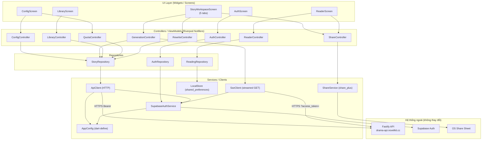
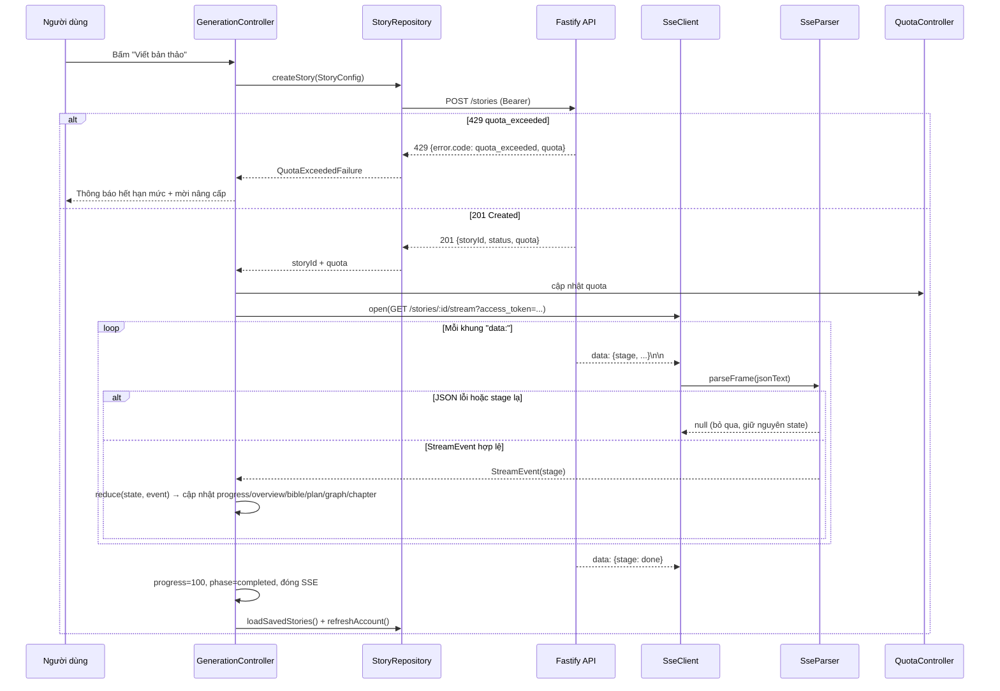
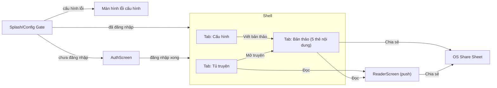

# Tài liệu Thiết kế

## Overview

Tài liệu này mô tả thiết kế kỹ thuật cho ứng dụng di động Flutter của nền tảng "Drama 15: Xưởng viết tiểu thuyết ngắn" (NovelKit Studio). Ứng dụng tái hiện đầy đủ quy trình sáng tác drama của bản web hiện tại, **sử dụng lại nguyên trạng** backend Fastify (`https://drama-api.novelkit.cc`) và Supabase Auth (Google OAuth) — **không xây dựng backend mới**. Ứng dụng giữ phong cách thị giác của bản web (nền giấy ngà, màu nhấn coral, phông serif cho tiêu đề và nội dung đọc) nhưng tối ưu cho cảm ứng và màn hình nhỏ, đồng thời bổ sung hai nhóm tính năng mới chỉ có trên di động: **Reader** kiểu Apple Books và **chia sẻ qua share sheet** của hệ điều hành.

Thiết kế bám sát hành vi của client web hiện có (`apps/web/src/story/StoryWorkspace.tsx`, `storyViewModel.ts`, `apps/web/src/api/*`) để bảo đảm tính tương thích tuyệt đối với API: cùng cấu trúc `StoryConfig`, cùng cách xử lý sự kiện SSE, cùng vị từ "có thể viết tiếp" (`canResumeStory`), cùng định dạng Markdown xuất bản.

### Mục tiêu thiết kế

- **Tương thích API tuyệt đối**: thân yêu cầu và cách đọc phản hồi khớp 100% với những gì web đang gửi/nhận. Một bản thảo Drama 15 luôn gồm cố định `TOTAL_CHAPTERS = 15` chương.
- **SSE bền vững**: vì Dart không có `EventSource` dựng sẵn, ứng dụng triển khai một SSE client riêng dựa trên streamed HTTP GET với phân tích thủ công các khung `data:`, an toàn trước JSON lỗi và `stage` lạ, và **idempotent** khi nạp lại cùng tập sự kiện chương.
- **Trải nghiệm đọc di động**: Reader có cỡ chữ rời rạc, ba chủ đề, độ sáng, chọn phông serif/sans-serif, mục lục, tiến độ %, điều hướng chương và khôi phục vị trí đọc.
- **Lưu trữ cục bộ khứ hồi**: `Reading_Settings` và `Reading_Position` lưu/nạp tương đương (round-trip).
- **Giao diện đồng nhất web**: bảng màu, phông, ngôn ngữ tiếng Việt; reflow lưới 3 cột của web thành điều hướng theo tab/bottom navigation.

### Quyết định công nghệ chính

| Hạng mục | Lựa chọn | Lý do tóm tắt |
|---|---|---|
| State management | **Riverpod** (`flutter_riverpod` / `hooks_riverpod`) | Phù hợp luồng dữ liệu bất đồng bộ (auth, SSE stream, quota), `StreamProvider`/`StateNotifierProvider` mô hình hóa tự nhiên SSE và phiên đăng nhập; dễ test (override provider), không phụ thuộc `BuildContext` cho logic. So với Bloc thì ít boilerplate hơn cho quy mô này; so với Provider thuần thì an toàn kiểu (compile-time) và composable hơn. |
| Auth | **`supabase_flutter`** | SDK chính thức, hỗ trợ Google OAuth qua deep link, lưu/khôi phục phiên, refresh token tự động — tương đương `@supabase/supabase-js` mà web dùng. |
| HTTP | **`http`** (hoặc `dio`) | `http` đủ cho REST + streamed response cho SSE. Chọn `http` để giữ nhẹ; SSE dùng `http.Client().send(Request)` lấy `StreamedResponse`. |
| Lưu cục bộ | **`shared_preferences`** | Đủ cho `Reading_Settings` và `Reading_Position` (dữ liệu nhỏ, key-value, JSON). |
| Chia sẻ | **`share_plus`** | Mở share sheet OS đa nền tảng, trả về `ShareResult` (phân biệt thành công/hủy). |
| Deep link OAuth | **`app_links`** (hoặc cơ chế tích hợp của `supabase_flutter`) | Bắt redirect URI sau đăng nhập Google. |
| PBT | **`fast_check`-tương đương Dart: `glados`** | Thư viện property-based testing cho Dart, tích hợp `package:test`; dùng cho 5 thuộc tính đã xác định. |
| Điều hướng | **`go_router`** | Khai báo route, hỗ trợ deep link, phù hợp cấu trúc tab/stack. |

### Quyết định cho các điểm còn mở (mục "Giả định và quyết định cần xác nhận" của requirements)

1. **Nền tảng mục tiêu**: thiết kế đa nền tảng iOS + Android ngay từ đầu (một codebase). Ưu tiên kiểm thử trên iOS trước vì Reader lấy cảm hứng Apple Books, nhưng không có mã riêng theo nền tảng ngoài cấu hình deep link.
2. **Deep link OAuth**: dùng custom scheme `cc.novelkit.drama15://login-callback` làm redirect URI cho di động (đăng ký trong Supabase Auth → Redirect URLs, và trong `Info.plist`/`AndroidManifest.xml`). `supabase_flutter` xử lý phần hoàn tất phiên.
3. **Đọc ngoại tuyến lâu dài**: Reader đọc ngoại tuyến **chỉ với nội dung đã nạp trong phiên** (giữ `StoryPayload` trong bộ nhớ qua Riverpod). Không lưu bền vững toàn bộ truyện để đọc offline về sau (ngoài `Reading_Position`/`Reading_Settings`). Đây là phạm vi tối thiểu thỏa Req 15.5.
4. **Phạm vi chia sẻ**: chia sẻ ở dạng **văn bản (chương) và Markdown (toàn truyện)** qua share sheet; không kèm ảnh bìa/liên kết web trong phiên bản này.
5. **CORS/Origin**: client di động gọi API trực tiếp (không qua trình duyệt) nên không gắn header `Origin`; backend hiện chỉ áp CORS theo `Origin` cho preflight của trình duyệt, không chặn theo User-Agent — do đó không cần thay đổi backend.

---

## Architecture

### Tổng quan kiến trúc phân tầng

Ứng dụng theo kiến trúc phân tầng rõ ràng (UI → Controllers/ViewModels → Repositories → Services/Clients → Models), state quản lý bằng Riverpod. Mục tiêu là tách biệt **transport (HTTP/SSE)**, **logic xử lý (parser, repository, view model)** và **UI** để dễ test và bảo trì (đáp ứng tinh thần tách lớp của bản web).



### Trách nhiệm từng tầng

- **UI Layer**: chỉ hiển thị state và phát sự kiện người dùng; không gọi network trực tiếp. Quan sát provider qua `ref.watch`.
- **Controllers/ViewModels**: `StateNotifier`/`AsyncNotifier` giữ state màn hình, điều phối repository, ánh xạ lỗi sang thông điệp tiếng Việt. Tương ứng các "Module" trong glossary (Auth_Module, Config_Module, Generation_Module, ...).
- **Repositories**: trừu tượng hóa nguồn dữ liệu (API hay local), trả về model thuần Dart; là nơi đặt logic thuần (markdown export, vị từ resume, upsert chapter) — dễ unit/property test.
- **Services/Clients**: `ApiClient` (REST), `SseClient` (streamed GET + parser), `SupabaseAuthService` (phiên/token), `LocalStore`, `ShareService`, `AppConfig`.
- **Models**: lớp dữ liệu bất biến (immutable) với `fromJson`/`toJson`, ánh xạ 1-1 với JSON của API.

### Khởi tạo cấu hình (Req 1)

`AppConfig` đọc ba giá trị nhúng lúc build qua `--dart-define`:

- `API_BASE_URL` (mặc định `https://drama-api.novelkit.cc`)
- `SUPABASE_URL`
- `SUPABASE_ANON_KEY`

Khi khởi động, `AppConfig.validate()` kiểm tra: `API_BASE_URL` và `SUPABASE_URL` phải là URL **HTTPS hợp lệ** (parse `Uri`, `scheme == 'https'`, có host); `SUPABASE_ANON_KEY` không rỗng. Kết quả validate là một `ConfigValidation` (danh sách các khóa không hợp lệ). Một `configValidProvider` (bool) cổng (gate) mọi thao tác mạng **mới**: nếu không hợp lệ, hiển thị màn hình/thông báo lỗi cấu hình nêu rõ khóa nào hỏng (Req 1.5), chặn yêu cầu mới (Req 1.9) nhưng cho phép yêu cầu đang chạy hoàn tất (Req 1.6). Khi cả ba hợp lệ, cho phép thao tác (Req 1.7).

### Luồng xác thực (Req 2)

`SupabaseAuthService` bọc `Supabase.instance.client.auth`:
- `signInWithGoogle()` gọi `signInWithOAuth(OAuthProvider.google, redirectTo: 'cc.novelkit.drama15://login-callback')` — mở trình duyệt hệ thống (Req 2.2, trong 2s).
- Deep link trả về được `supabase_flutter` xử lý, phát `onAuthStateChange` → `AuthController` cập nhật phiên và gọi `GET /auth/me` (Req 2.3, 2.4).
- `currentAccessToken()` trả token còn hiệu lực (Supabase tự refresh); dùng cho cả header REST và query SSE.
- `restoreSession()` khôi phục phiên đã lưu khi khởi động (Req 2.9); nếu hết hiệu lực thì xóa và về trạng thái chưa đăng nhập (Req 2.11).
- `signOut()` kết thúc phiên, đóng SSE đang mở, xóa state hồ sơ/quota/danh sách (Req 2.7).

### Luồng sinh truyện qua SSE (Req 5, 6, 9)



Sự kiện chương được áp dụng qua `upsertChapterByIndex` (xóa chương cùng `index` rồi chèn lại, sort theo `index`) — bảo đảm **idempotent** khi nạp lại cùng tập sự kiện (Req 6.5). Khi SSE đứt trước `done`, `GenerationController` đóng luồng, chuyển truyện sang trạng thái "cần thử lại" và hướng dẫn bấm "Viết tiếp truyện" (Req 15.2).

Viết tiếp (resume, Req 9): `GET /stories/:id` để nạp bản thảo dang dở → `POST /stories/:id/resume` → mở lại SSE. Xử lý 409 `story_completed` / `story_not_resumable` (Req 9.4, 9.5).

### Điều hướng (Req 14)



`AppShell` dùng `BottomNavigationBar` 3 mục chính (Cấu hình, Bản thảo, Tủ truyện). Trong tab Bản thảo, năm thẻ nội dung "Chương / Ý tưởng / Dàn ý / Hồ sơ / Quan hệ" hiển thị bằng `TabBar` + `TabBarView` (Req 5.11). Reader và share sheet là các màn hình/được mở chồng (push/modal). Lưới 3 cột của web (setup | story | saved) được reflow thành luồng một cột theo tab (Req 14.2).

---

## Components and Interfaces

### AppConfig (Config_Module hạ tầng — Req 1)

```dart
class AppConfig {
  final String apiBaseUrl;      // từ --dart-define API_BASE_URL
  final String supabaseUrl;     // từ --dart-define SUPABASE_URL
  final String supabaseAnonKey; // từ --dart-define SUPABASE_ANON_KEY

  ConfigValidation validate();  // kiểm tra HTTPS + non-empty
  bool get isValid;
}

class ConfigValidation {
  final List<String> invalidKeys; // ví dụ: ['API_BASE_URL']
  bool get isValid => invalidKeys.isEmpty;
}
```

- `validateHttpsUrl(String)`: hàm thuần kiểm tra một chuỗi là URL HTTPS hợp lệ (dùng `Uri.tryParse`, `scheme=='https'`, `host` không rỗng). Dùng chung cho `API_BASE_URL` và `SUPABASE_URL`.

### SupabaseAuthService (Auth_Module — Req 2)

```dart
abstract class SupabaseAuthService {
  Stream<AuthSessionState> get authStateChanges;
  AuthSession? get currentSession;
  Future<String?> currentAccessToken();         // null nếu không có token hiệu lực
  Future<void> signInWithGoogle();              // mở OAuth, redirect deep link
  Future<void> signOut();
  Future<AuthSession?> restoreSession();         // khi khởi động
}
```

### ApiClient (API_Client — Req 1, 15)

```dart
class ApiClient {
  ApiClient(this._config, this._auth, this._httpClient, this._configGate);

  // Gắn Authorization: Bearer <token> cho endpoint cần auth (Req 1.3).
  // Mọi request đi qua HTTPS (Req 1.8). Chặn nếu config không hợp lệ (Req 1.9)
  // hoặc thiếu token cho endpoint cần auth (Req 1.10).
  Future<ApiResponse<T>> get<T>(String path, {bool authRequired = true, T Function(Map<String,dynamic>)? decode});
  Future<ApiResponse<T>> post<T>(String path, {Object? body, bool authRequired = true, ...});
  Future<ApiResponse<T>> patch<T>(String path, {Object? body, ...});
  Future<void> delete(String path);
}
```

`ApiResponse<T>` là union: `ApiSuccess<T>(data, httpStatus)` hoặc `ApiFailure(kind, message, code?, httpStatus?)` với `ApiFailureKind { network, unauthorized, quota, validation, notFound, conflict, server, config }`. `message` lấy từ `error.message` của body khi có (Req 15.3); `code` lấy từ `error.code` (để phân biệt `quota_exceeded`, `setup_suggestion_quota_exceeded`, `story_completed`, `story_not_resumable`). HTTP 401 → `unauthorized` → nhắc đăng nhập lại (Req 15.4). Lỗi mạng (SocketException/timeout) → `network`, giữ nguyên dữ liệu hiển thị (Req 15.1).

### SseClient + SseParser (SSE_Parser — Req 5, 6)

Dart không có `EventSource`. Triển khai SSE bằng streamed HTTP GET và phân tích thủ công khung `data:`.

```dart
class SseClient {
  // Mở GET /stories/:id/stream?access_token=<urlEncoded> qua HTTPS.
  // Trả về Stream<StreamEvent> đã được parse & lọc.
  Stream<StreamEvent> connect(String storyId, {required String accessToken});
  void close();
}

/// Hàm thuần, dễ test.
class SseParser {
  /// Tách buffer thành các "event block" ngăn cách bởi dòng trống,
  /// ghép các dòng "data:" trong một block, parse JSON.
  /// Trả về null nếu JSON không hợp lệ (Req 6.3) hoặc stage không hợp lệ (Req 6.4).
  static StreamEvent? parseFrame(String rawEventBlock);

  /// Tách buffer luỹ kế thành (danh sách block hoàn chỉnh, phần dư còn lại).
  static (List<String> blocks, String remainder) splitBuffer(String buffer);
}
```

Chi tiết phân tích:
- Đọc `response.stream.transform(utf8.decoder)`, tích lũy vào buffer; tách theo `\n\n` (ranh giới sự kiện SSE). Phần chưa đủ một block giữ lại làm remainder.
- Trong mỗi block, lấy các dòng bắt đầu bằng `data:`, bỏ tiền tố, nối bằng `\n` (theo chuẩn SSE).
- `jsonDecode` trong `try/catch`: lỗi → trả `null` (bỏ qua, không dừng luồng).
- Đọc trường `stage`; nếu không thuộc tập hợp lệ `{progress, overview, bible, plan, relationshipGraph, chapter, done, error}` → trả `null` (Req 6.2, 6.4).
- Map còn lại thành `StreamEvent` (xem Data Models).

`SseClient` không tự reduce state; nó chỉ phát `StreamEvent`. `GenerationController` áp dụng reducer (thuần) `reduceStream(StoryWorkspaceState, StreamEvent) -> StoryWorkspaceState` để cập nhật, giúp test reducer độc lập (kể cả idempotency chương).

### StoryRepository (Config/Suggest/Generation/Library/Rewrite/Quota)

```dart
class StoryRepository {
  Future<ApiResponse<List<StylePreset>>> getStylePresets();           // Req 3.4/3.5
  Future<ApiResponse<AccountSnapshot>> getAuthMe();                   // Req 2.4, 7.5
  Future<ApiResponse<SetupSuggestion>> setupSuggest(StoryConfig c);  // Req 4
  Future<ApiResponse<List<SavedStory>>> listStories();               // Req 8.1
  Future<ApiResponse<CreateStoryResult>> createStory(StoryConfig c); // Req 5.1, 7.4
  Future<ApiResponse<StoryDetail>> getStory(String id);              // Req 8.3, 9.3
  Future<ApiResponse<ResumeResult>> resumeStory(String id);          // Req 9.3-9.5
  Future<ApiResponse<RewriteResult>> rewriteChapter(String id, RewriteRequest r); // Req 10
  Future<ApiResponse<SavedStory>> renameStory(String id, String title); // Req 8.4
  Future<ApiResponse<void>> deleteStory(String id);                  // Req 8.5

  // Hàm thuần (logic), tách khỏi network:
  static bool canResumeStory(SavedStory s);                 // Req 9.1
  static List<Chapter> upsertChapterByIndex(List<Chapter> existing, Chapter next); // Req 6.5
  static String buildStoryMarkdown(String title, StoryPayload payload); // Req 13.2, 13.3
  static String buildChapterShareText(String title, Chapter chapter);   // Req 13.1
}
```

`canResumeStory` ánh xạ chính xác hàm web: `status != 'completed' && (canResume == true || (chapterCount > 0 && chapterCount < TOTAL_CHAPTERS))`.

### ReadingRepository + LocalStore (Reader persistence — Req 12)

```dart
class ReadingRepository {
  Future<ReadingSettings> loadSettings();                 // Req 12.2
  Future<void> saveSettings(ReadingSettings s);           // Req 12.1
  Future<ReadingPosition?> loadPosition(String storyId);  // Req 12.4, 12.7
  Future<void> savePosition(String storyId, ReadingPosition p); // Req 12.3
}
```

`LocalStore` bọc `shared_preferences`, lưu JSON. Khóa: `reading_settings` (toàn cục) và `reading_position:<storyId>` (theo truyện). (De)serialize qua `ReadingSettings.toJson/fromJson` và `ReadingPosition.toJson/fromJson` — là tâm điểm của hai thuộc tính khứ hồi (Req 12.5, 12.6).

### ReaderController (Reader — Req 11, 12)

Giữ `ReaderState`: `chapters` (sort tăng theo `index`), `currentChapterIndex`, `inChapterProgress` (0..1), `settings`. Cung cấp:
- `goToChapter(int index)`, `nextChapter()`, `prevChapter()` với vô hiệu hóa ở biên (Req 11.8, 11.11, 11.12).
- `updateSettings(...)` áp dụng tức thời (Req 11.10) và lưu (Req 12.1).
- `progressPercent()`: hàm thuần tính % theo chương hiện tại + tiến độ trong chương trên tổng số chương (Req 11.7).
- Khôi phục `Reading_Position` khi mở (Req 11.9, 12.4); mở ở chương đầu nếu chưa có (Req 12.7).

### ShareService + ShareController (Share_Module — Req 13)

```dart
abstract class ShareService {
  Future<ShareOutcome> shareText(String text, {String? subject}); // ShareOutcome { success, dismissed, failure }
}
```

`ShareController` quyết định bật/tắt thao tác: tắt chia sẻ toàn truyện khi `chapterCount == 0` (Req 13.4), tắt chia sẻ chương khi nội dung rỗng (Req 13.5). Dùng `buildStoryMarkdown`/`buildChapterShareText`. Xử lý `dismissed` (không báo lỗi, Req 13.7) và `failure` (báo lỗi, giữ màn hình, Req 13.6).

### Theme (giao diện — Req 14)

`AppTheme` định nghĩa `ThemeData` ánh xạ token CSS của web:
- Màu: `pageBg #f1e9d8`, `paper #fbf7ee`, `canvas #fdfaf3`, `ink #1a1611`, `muted #6b6253`, `coral #d7634e`, `coralDark #b9452f`.
- Phông: serif **Fraunces/Lora** cho tiêu đề và nội dung đọc; sans **Inter** cho UI; mono **JetBrains Mono** cho nhãn nhỏ (eyebrow/kicker). Nhúng qua `google_fonts` hoặc bundle asset.
- Kích thước chạm: nút/thanh trượt/thẻ tối thiểu ~48 logical px (Req 14.4).
- `MediaQuery`/`LayoutBuilder` cho xoay màn hình và reflow (Req 14.5).

Reader có hệ màu riêng theo `ReaderTheme { light, sepia, dark }` (Req 11.3), độc lập với theme app, kèm lớp phủ độ sáng (Req 11.4).

---

## Data Models

Tất cả model là lớp bất biến Dart với `fromJson`/`toJson`, ánh xạ 1-1 JSON của API hiện có. Các kiểu liệt kê (enum) phản ánh đúng tập giá trị API.

### StoryConfig (Req 3, gửi tới API)

```dart
class StoryConfig {
  final String niche;            // 1 trong 13 lựa chọn (gồm 'custom')
  final String customNiche;      // mặc định ''
  final String title;            // cho phép rỗng
  final String seed;             // cho phép rỗng
  final OutputLanguage outputLanguage; // vietnamese (mặc định) | english | japanese | korean | spanish | portuguese
  final double intensity;        // 0..1, mặc định 0.84
  final double dialogueRatio;    // 0.2..0.85, mặc định 0.56
  final double hookDensity;      // 0..1, mặc định 0.67
  final String stylePreset;      // id giọng kể; fallback 'co_man_warm_modern_blueprint'
  final StoryControls? storyControls;

  Map<String, dynamic> toJson(); // khớp StoryConfigSchema của API
}
```

Body gửi lên khớp `StoryConfigSchema` trong `apps/api/src/startDev.ts`: các khóa `niche, customNiche, title, seed, outputLanguage, intensity, dialogueRatio, hookDensity, stylePreset, storyControls?`. Mặc định trùng `DEFAULT_CONFIG` của web (Req 3.10).

Danh sách 13 `niche` và nhãn tiếng Việt được hằng số hóa (`NICHES`) đúng như web (Req 3.1).

### StoryControls

```dart
class StoryControls {
  final String betrayalType;
  final String shameType;
  final String revengeMode;
  final String endingMode;
  final double intensity;
}
```

Nhận từ `setup-suggest` và gửi lại trong `StoryConfig` (Req 4.2).

### StylePreset (Req 3.4)

```dart
class StylePreset { final String id; final String displayName; final String description; }
```

`GET /story/style-presets` → `{ presets: [...] }`. Fallback khi lỗi: `StylePreset(id: 'co_man_warm_modern_blueprint', displayName: 'Cố Mạn - ấm áp hiện đại', description: '')` (Req 3.5).

### SetupSuggestion (Req 4)

```dart
class SetupSuggestion {
  final String? title;
  final String? seed;
  final String? linePreset;
  final StoryControls? storyControls;
  final DraftControls? draftControls;
  final Quota? setupSuggestionQuota;
}
```

### AppUser, Quota, AccountSnapshot (Req 2, 7)

```dart
enum UserTier { free, pro, premium }

class AppUser {
  final String id;
  final String email;
  final String displayName;   // rỗng → dùng email khi hiển thị
  final String? avatarUrl;
  final UserTier tier;        // nhãn: Miễn phí / Pro / Premium
}

class Quota {
  final String usageDate;     // 'YYYY-MM-DD' (giờ VN)
  final int used;
  final int limit;
  final int remaining;        // hiển thị "còn {remaining}/{limit}"
}

class AccountSnapshot {
  final AppUser user;
  final Quota quota;
  final Quota? setupSuggestionQuota; // null với tier không giới hạn
}
```

`GET /auth/me` → `{ user, quota, setupSuggestionQuota }`.

### SavedStory / StoryDetail (Req 8, 9)

```dart
enum StoryStatus { queued, running, completed, failed }
// Nhãn VN: Đang chờ / Đang viết / Hoàn tất / Có lỗi

class SavedStory {
  final String id;
  final String title;
  final StoryStatus status;
  final String createdAt;
  final String updatedAt;
  final String? completedAt;
  final int chapterCount;
  final bool? canResume;
  final String? error;
}

class StoryDetail extends SavedStory {
  final StoryPayload? storyPayload;
  final RelationshipGraph? relationshipGraph;
}
```

`GET /stories` → `{ stories: SavedStory[] }`. `GET /stories/:id` → `{ story: StoryDetail }`.

### StoryPayload + Chapter (Req 5, 11, 13)

```dart
class Concept { final String logline; final String promise; final String conflictEngine; }

class ChapterPlanItem {
  final int chapterNumber; final String title;
  final String mainBeat; final String hook; final String endingBeat;
}

class Chapter {
  final int index;        // == chapterNumber phía client (toClientChapter)
  final String? title;
  final String content;   // text chương
  bool get isEmpty => content.trim().isEmpty;
}

class StoryPayload {
  final String title;
  final Concept concept;
  final dynamic storyBible;            // hiển thị dạng JSON đã format ở thẻ "Hồ sơ"
  final List<ChapterPlanItem> chapterPlan;
  final List<Chapter> chapters;        // có thể chưa đủ 15 khi đang chạy
  final RelationshipGraph? relationshipGraph;
}
```

Lưu ý ánh xạ: trong `StoryPayload` gốc của server, chương có `chapterNumber`/`text`; nhưng client nhận chương qua SSE và REST dưới dạng `{ index, title, content }` (server đã chuyển đổi bằng `toClientChapter`). Khi đọc `GET /stories/:id` (trả `storyPayload` gốc), repository chuẩn hóa `chapters[i] = { index: chapterNumber, title, content: text }` để thống nhất với luồng SSE (giống `resultFromPayload` của web).

### RelationshipGraph (Req 5.7, 10.4)

```dart
class RelationshipNode { final String id; final String name; final String role; final String description; }
class RelationshipEdge {
  final String source; final String target; final String label; final String type;
  final int? chapterNumber; final String? confidence; // 'explicit' | 'inferred'
}
class RelationshipGraph { final List<RelationshipNode> nodes; final List<RelationshipEdge> edges; final String? updatedAt; }
```

`normalizeRelationshipGraph`: bỏ qua nếu không có `nodes` hợp lệ; lọc node/edge theo điều kiện trường bắt buộc (giống `storyViewModel.ts`).

### StreamEvent (SSE — Req 5, 6)

```dart
enum StreamStage { progress, overview, bible, plan, relationshipGraph, chapter, done, error }

class StreamEvent {
  final StreamStage stage;            // luôn hợp lệ (event stage lạ đã bị parser loại)
  final String? title;
  final String? concept;
  final dynamic bible;
  final dynamic relationshipGraph;
  final String? plan;
  final Chapter? chapter;
  final String? label;
  final String? detail;
  final int? current;
  final int? total;
  final String? error;
}
```

### RewriteRequest / RewriteResult (Req 10)

```dart
enum RewriteMode { full_chapter, opening_hook, closing_beat, dialogue_tone, class_humiliation, retaliation_sharpness }
// Nhãn VN tương ứng REWRITE_MODES của web.

class RewriteRequest { final int chapterIndex; final String mode; final String instruction; }
class RewriteResult { final Chapter chapter; final StoryPayload? storyPayload; final RelationshipGraph? relationshipGraph; }
```

`POST /stories/:id/rewrite` body `{ chapterIndex, mode, instruction }`.

### CreateStoryResult / ResumeResult

```dart
class CreateStoryResult { final String storyId; final StoryStatus status; final Quota quota; } // 201
class ResumeResult { final String storyId; final StoryStatus status; } // 200
```

### Reading_Settings / Reading_Position (Req 11, 12)

```dart
enum ReaderTheme { light, sepia, dark }
enum ReaderFontFamily { serif, sansSerif }

class ReadingSettings {
  final double fontSize;        // 12..28, bước rời rạc {12,16,18,22,28} (>=5 bước), mặc định 18
  final ReaderTheme theme;      // mặc định light
  final double brightness;      // 0..1, mặc định 1.0
  final ReaderFontFamily fontFamily; // mặc định serif

  Map<String,dynamic> toJson(); factory ReadingSettings.fromJson(Map<String,dynamic>);
  static const defaults = ReadingSettings(fontSize: 18, theme: light, brightness: 1.0, fontFamily: serif);
}

class ReadingPosition {
  final int chapterIndex;       // index chương hiện tại
  final double inChapterProgress; // 0..1 tiến độ cuộn trong chương

  Map<String,dynamic> toJson(); factory ReadingPosition.fromJson(Map<String,dynamic>);
}
```

`fromJson` phải **chấp nhận và chuẩn hóa** giá trị (kẹp `fontSize` về bước hợp lệ gần nhất, `brightness` về [0,1]) để bảo đảm round-trip ổn định và an toàn trước dữ liệu cũ/hỏng.

### Bảng ánh xạ Component → Requirements

| Requirement | Thành phần thiết kế chính |
|---|---|
| 1 Cấu hình API/Supabase | `AppConfig`, `ApiClient`, `configValidProvider` |
| 2 Đăng nhập Google | `SupabaseAuthService`, `AuthController`, deep link |
| 3 Cấu hình truyện | `ConfigController`, `StoryConfig`, `StylePreset`, `StoryRepository.getStylePresets` |
| 4 Gợi ý kịch bản | `SuggestController` (trong ConfigController), `setupSuggest`, `SetupSuggestion` |
| 5 Sinh truyện SSE | `GenerationController`, `SseClient`, `reduceStream`, 5 thẻ nội dung |
| 6 Parse SSE an toàn | `SseParser`, `upsertChapterByIndex` |
| 7 Hạn mức | `QuotaController`, `Quota` |
| 8 Tủ truyện | `LibraryController`, `StoryRepository` (list/get/rename/delete) |
| 9 Viết tiếp | `GenerationController.resume`, `canResumeStory` |
| 10 Viết lại chương | `RewriteController`, `RewriteRequest/Result` |
| 11 Reader | `ReaderController`, `ReaderScreen`, `ReaderTheme` |
| 12 Lưu cục bộ | `ReadingRepository`, `LocalStore`, `ReadingSettings/Position` |
| 13 Chia sẻ | `ShareController`, `ShareService`, `buildStoryMarkdown` |
| 14 Giao diện | `AppTheme`, `AppShell`, điều hướng tab/bottom-nav |
| 15 Lỗi/offline | `ApiClient` (ApiFailure), `GenerationController` (SSE disconnect) |

---

## Correctness Properties

*Một thuộc tính (property) là đặc tính hoặc hành vi cần luôn đúng trên mọi lần thực thi hợp lệ của hệ thống — về bản chất là một phát biểu hình thức về điều phần mềm phải làm. Các thuộc tính đóng vai trò cầu nối giữa đặc tả ngôn ngữ tự nhiên và những bảo đảm đúng đắn có thể kiểm chứng bằng máy.*

Phần lớn logic cốt lõi của ứng dụng là **hàm thuần** (parser SSE, upsert chương, vị từ resume, (de)serialize cấu hình/thiết lập đọc, dựng Markdown, tính tiến độ) nên rất phù hợp property-based testing. Mỗi thuộc tính dưới đây sẽ được hiện thực bằng **một** property-based test (tối thiểu 100 vòng lặp). Các tiêu chí kiểu UI/tích hợp (mở OAuth, mở share sheet, render, animation, deep link) được kiểm bằng widget/integration test, không phải PBT.

### Property 1: Tính hợp lệ cấu hình và cổng thao tác mạng

*Với mọi* tổ hợp giá trị `API_BASE_URL`, `SUPABASE_URL`, `SUPABASE_ANON_KEY` (gồm chuỗi HTTPS hợp lệ, chuỗi `http`, chuỗi không phải URL, chuỗi rỗng), `AppConfig.validate()` SHALL trả về `invalidKeys` đúng bằng tập các khóa không hợp lệ, và thao tác mạng mới được cho phép khi và chỉ khi `invalidKeys` rỗng (`isValid`).

**Validates: Requirements 1.1, 1.2, 1.5, 1.7, 1.9**

### Property 2: Dựng URL an toàn và mã hóa access_token khứ hồi

*Với mọi* `path` tương đối và mọi chuỗi `accessToken` (kể cả chứa ký tự đặc biệt như khoảng trắng, `&`, `=`, `+`, ký tự Unicode), URL mà `ApiClient` và `SseClient` dựng ra SHALL luôn có scheme `https`, và với URL stream, giải mã `Uri.queryParameters['access_token']` SHALL cho lại đúng `accessToken` ban đầu.

**Validates: Requirements 1.4, 1.8**

### Property 3: Khứ hồi tuần tự hóa StoryConfig

*Với mọi* `StoryConfig` hợp lệ, `StoryConfig.fromJson(config.toJson())` SHALL cho ra một cấu hình tương đương với cấu hình ban đầu, và `toJson()` SHALL chứa đầy đủ các khóa mà `StoryConfigSchema` của API yêu cầu.

**Validates: Requirements 3.10**

### Property 4: Tính toàn vẹn của ánh xạ nhãn hiển thị

*Với mọi* `AppUser` và mọi `StoryStatus`, nhãn người dùng SHALL bằng `email` khi `displayName` rỗng và bằng `displayName` khi không rỗng; nhãn gói SHALL ánh xạ đúng (`free`→"Miễn phí", `pro`→"Pro", `premium`→"Premium"); và nhãn trạng thái SHALL ánh xạ đúng cho mọi giá trị (`queued`→"Đang chờ", `running`→"Đang viết", `completed`→"Hoàn tất", `failed`→"Có lỗi") mà không bỏ sót giá trị nào.

**Validates: Requirements 2.6, 8.2**

### Property 5: Phân tích SSE khứ hồi và chỉ chấp nhận stage hợp lệ

*Với mọi* `StreamEvent` hợp lệ được mã hóa thành khung `data:` đúng chuẩn SSE, `SseParser.parseFrame` SHALL phân tích lại thành một sự kiện có cùng `stage` và các trường dữ liệu tương ứng; và *với mọi* khung chứa JSON không hợp lệ hoặc có `stage` ngoài tập `{progress, overview, bible, plan, relationshipGraph, chapter, done, error}`, `parseFrame` SHALL trả về `null` (bỏ qua) mà không ném lỗi.

**Validates: Requirements 6.1, 6.2, 6.3, 6.4**

### Property 6: Tính lũy đẳng (idempotent) của việc nạp chương qua SSE

*Với mọi* dãy sự kiện `chapter` (các `index` có thể trùng lặp và đến theo thứ tự bất kỳ), việc áp dụng dãy đó một lần và việc áp dụng nó nhiều lần (kể cả lặp lại toàn bộ dãy) qua `upsertChapterByIndex`/`reduceStream` SHALL cho ra cùng một tập chương — mỗi `index` xuất hiện đúng một lần với nội dung của sự kiện cuối cùng cho `index` đó, và danh sách được sắp theo `index` tăng dần.

**Validates: Requirements 6.5, 5.8**

### Property 7: Phần trăm tiến độ sinh truyện luôn hợp lệ

*Với mọi* sự kiện `progress` có `current` và `total` bất kỳ (bao gồm `total = 0`), phần trăm tiến độ mà `reduceStream` tính ra SHALL luôn nằm trong khoảng [0, 100], và nhãn tiến độ SHALL ưu tiên `detail` rồi đến `label`.

**Validates: Requirements 5.3**

### Property 8: Vị từ "có thể viết tiếp truyện"

*Với mọi* `SavedStory` (với `status` bất kỳ, `canResume` nhận `null`/`true`/`false`, và `chapterCount` trải từ 0 đến quá `TOTAL_CHAPTERS`), `canResumeStory(story)` SHALL trả về `true` khi và chỉ khi `status != completed` và (`canResume == true` hoặc `0 < chapterCount < TOTAL_CHAPTERS`).

**Validates: Requirements 9.1**

### Property 9: Reader hiển thị chương theo thứ tự index tăng dần

*Với mọi* `StoryPayload` có danh sách chương với `index` ở thứ tự bất kỳ, danh sách chương mà Reader trình bày (và mục lục) SHALL được sắp theo `index` tăng dần; điều khiển "chương trước" SHALL bị vô hiệu khi và chỉ khi chương hiện tại có `index` nhỏ nhất, và "chương kế tiếp" SHALL bị vô hiệu khi và chỉ khi chương hiện tại có `index` lớn nhất.

**Validates: Requirements 11.1, 11.6, 11.11, 11.12**

### Property 10: Phần trăm tiến độ đọc luôn hợp lệ và đơn điệu

*Với mọi* trạng thái đọc (chỉ số chương hiện tại trong khoảng hợp lệ, `inChapterProgress` trong [0,1], tổng số chương ≥ 1), `progressPercent` SHALL luôn nằm trong [0, 100], không giảm khi `inChapterProgress` tăng hoặc khi chuyển sang chương sau, bằng 0 tại đầu chương đầu tiên và bằng 100 tại cuối chương cuối cùng.

**Validates: Requirements 11.7**

### Property 11: Khứ hồi lưu/nạp Reading_Settings

*Với mọi* `ReadingSettings` hợp lệ (cỡ chữ trong tập bước rời rạc 12–28, chủ đề thuộc {light, sepia, dark}, độ sáng trong [0,1], phông thuộc {serif, sansSerif}), việc lưu rồi nạp lại qua `ReadingRepository`/`LocalStore` SHALL cho ra một tập thiết lập tương đương với tập đã lưu.

**Validates: Requirements 12.5**

### Property 12: Khứ hồi lưu/nạp Reading_Position

*Với mọi* `ReadingPosition` hợp lệ (`chapterIndex` và `inChapterProgress` trong [0,1]) và mọi `storyId`, việc lưu rồi nạp lại vị trí cho truyện đó SHALL cho ra một vị trí tương đương với vị trí đã lưu.

**Validates: Requirements 12.6**

### Property 13: Markdown bản thảo theo thứ tự index tăng dần

*Với mọi* `StoryPayload` có nhan đề và danh sách chương với `index` ở thứ tự bất kỳ, `buildStoryMarkdown` SHALL sinh ra một tài liệu chứa nhan đề truyện và toàn bộ các chương, trong đó các chương xuất hiện theo thứ tự `index` tăng dần (vị trí xuất hiện trong văn bản đơn điệu tăng theo `index`).

**Validates: Requirements 13.2, 13.3**

---

## Error Handling

Chiến lược xử lý lỗi tập trung tại `ApiClient` (chuẩn hóa thành `ApiFailure`) và tại các controller (ánh xạ sang thông điệp tiếng Việt + quyết định giữ/đổi state). Nguyên tắc chung: **giữ nguyên dữ liệu đang hiển thị khi gặp lỗi** trừ khi có cập nhật thành công.

| Tình huống | Phát hiện | Xử lý | Requirement |
|---|---|---|---|
| Cấu hình thiếu/không hợp lệ | `AppConfig.validate()` lúc khởi động/trước request | Hiển thị màn hình lỗi nêu khóa hỏng; chặn request mới; cho request đang chạy hoàn tất | 1.5, 1.6, 1.9 |
| Thiếu access token cho endpoint cần auth | `currentAccessToken() == null` | Không gửi request; nhắc đăng nhập lại; giữ state | 1.10 |
| Lỗi mạng (SocketException/timeout) | catch trong `ApiClient` | `ApiFailure.network`; thông báo "lỗi kết nối"; giữ dữ liệu; cho thử lại khi online lại | 15.1, 15.6 |
| HTTP 401 | status code | `ApiFailure.unauthorized`; nhắc đăng nhập lại | 15.4 |
| HTTP 429 `quota_exceeded` | `error.code` | Thông báo hết bản thảo + mời nâng cấp; cập nhật quota từ body | 7.4 |
| HTTP 429 `setup_suggestion_quota_exceeded` | `error.code` | Thông báo hết lượt gợi ý kịch bản | 4.4 |
| HTTP 409 `story_completed` | `error.code` | Thông báo truyện đã hoàn tất | 9.4 |
| HTTP 409 `story_not_resumable` | `error.code` | Thông báo chưa có bản thảo từng phần để viết tiếp | 9.5 |
| Lỗi API kèm `error.message` | body `{error:{message}}` | Hiển thị đúng `error.message` cho người dùng | 15.3 |
| Nạp `/auth/me` thất bại sau khi có phiên | response không thành công | Giữ trạng thái đăng nhập; nút "Thử lại"; tự retry ≤3 lần, cách 5s | 2.5 |
| SSE đứt trước `done` | `onError`/`onDone` của stream | Đóng luồng; chuyển truyện sang "cần thử lại"; hướng dẫn bấm "Viết tiếp truyện"; làm mới danh sách | 15.2 |
| SSE JSON lỗi / stage lạ | `SseParser.parseFrame` trả `null` | Bỏ qua sự kiện; giữ nguyên state; luồng tiếp tục | 6.3, 6.4 |
| Đăng nhập Google lỗi/hủy/timeout (120s) | service ném/hủy | Thông báo lỗi đăng nhập; giữ trạng thái chưa đăng nhập | 2.10 |
| Phiên khôi phục hết hiệu lực | `restoreSession` trả phiên hết hạn | Xóa phiên; về trạng thái chưa đăng nhập + nhắc đăng nhập lại | 2.11 |
| Thao tác tủ truyện lỗi | `ApiFailure` | Thông báo lỗi; giữ nguyên danh sách trước đó | 8.7 |
| Share sheet không mở được | `ShareOutcome.failure` | Thông báo không thể chia sẻ; giữ màn hình | 13.6 |
| Người dùng hủy chia sẻ | `ShareOutcome.dismissed` | Trở lại màn hình; không báo lỗi | 13.7 |
| Đọc khi offline | không có mạng | Reader đọc nội dung `StoryPayload` đã nạp trong phiên (bộ nhớ) | 15.5 |

Mọi thông điệp lỗi hiển thị bằng tiếng Việt (Req 14.6). `error.message` từ API thường đã là tiếng Việt nên được hiển thị trực tiếp.

---

## Testing Strategy

Áp dụng **phương pháp kiểm thử kép**: property-based test cho logic thuần phổ quát, và example/widget/integration test cho hành vi cụ thể, biên, lỗi và giao diện.

### Property-Based Testing

- **Thư viện**: `glados` (PBT cho Dart, tích hợp `package:test`). Không tự hiện thực PBT từ đầu.
- **Số vòng lặp**: tối thiểu **100** vòng cho mỗi property test (cấu hình `Explore(numRuns: 100)` hoặc tương đương).
- **Tag**: mỗi property test gắn comment theo định dạng **Feature: flutter-drama-mobile-app, Property {number}: {property_text}**.
- **Một property ↔ một property-based test**: 13 property ở mục Correctness Properties được hiện thực bằng đúng 13 test tương ứng.
- **Generators cần xây**:
  - `anyStoryConfig` (niche gồm `custom`, ngôn ngữ trong tập 6, các slider trong miền hợp lệ, `storyControls?`) — cho P3.
  - `anyConfigTriple` (mỗi khóa: HTTPS hợp lệ | http | không-URL | rỗng) — cho P1.
  - `anyAccessToken` (gồm ký tự đặc biệt và Unicode) + `anyPath` — cho P2.
  - `anyStreamEventValid` và `anyRawFrame` (gồm JSON hỏng và stage lạ — phủ edge case 6.3/6.4) — cho P5.
  - `anyChapterEventSequence` (index trùng, thứ tự ngẫu nhiên) — cho P6.
  - `anyProgressEvent` (gồm `total = 0`) — cho P7.
  - `anySavedStory` (status, canResume null/true/false, chapterCount 0..16) — cho P8.
  - `anyChapters` (index xáo trộn, có thể thưa) — cho P9 và P13.
  - `anyReaderState` (currentIndex hợp lệ, inChapterProgress ∈[0,1], total≥1) — cho P10.
  - `anyReadingSettings`, `anyReadingPosition` — cho P11, P12.
- **Lưu cục bộ trong test**: dùng `LocalStore` in-memory (fake `shared_preferences` qua `SharedPreferences.setMockInitialValues`) để round-trip P11/P12 không chạm I/O thật.

### Unit Tests (example/edge)

Tập trung vào: gắn header `Authorization` (1.3), không gửi khi thiếu token (1.10), cho request đang chạy hoàn tất (1.6), merge config sau gợi ý (4.2), các nhánh reduce overview/bible/plan/graph/done (5.4–5.9), fallback style preset (3.5), các nhánh lỗi 401/429/409 (4.4, 7.4, 9.4, 9.5, 15.4), retry `/auth/me` với fake timer (2.5), trình tự resume (9.3), rename/delete/refresh tủ truyện (8.4–8.6), khôi phục/không có vị trí đọc (12.4, 12.7), build text chia sẻ chương (13.1), ShareOutcome failure/dismissed (13.6, 13.7), Reader đọc offline từ state (15.5), retry khi online lại (15.6). Tránh viết quá nhiều unit test trùng phạm vi với property test.

### Widget Tests

5 thẻ nội dung đúng nhãn (5.11), nút "Đăng nhập bằng Google" khi chưa đăng nhập (2.1), `custom` hiện trường nhánh riêng (3.2), vô hiệu nút theo quota/instruction/empty (4.5, 7.3, 10.5, 13.4, 13.5), điều hướng bottom-nav + push Reader (14.3), áp dụng `Reading_Settings` tức thời (11.10), mục lục chọn chương (11.6), hai orientation (14.5).

### Integration / Smoke Tests

- **Integration** (1–3 ví dụ, phụ thuộc ngoài): luồng OAuth Google mở trình duyệt và hoàn tất qua deep link (2.2, 2.3), khôi phục/hết hạn phiên Supabase khi khởi động (2.9, 2.11), mở share sheet OS thật (13.1, 13.2), kết nối SSE thật tới một story đang chạy (smoke end-to-end của 5.x).
- **Smoke** (một lần): theme tokens khớp giá trị web (14.1), kích thước phần tử chạm tối thiểu (14.4), nhãn UI là tiếng Việt (14.6).

### Lý do một số tiêu chí KHÔNG dùng PBT

- Mở OAuth/share sheet, deep link, khôi phục phiên Supabase: phụ thuộc dịch vụ/OS bên ngoài, hành vi không biến thiên theo input — dùng integration test.
- Render giao diện, animation, bảng màu, orientation: thuộc trình bày trực quan — dùng widget/snapshot/manual.
- Các nhánh điều phối và xử lý mã lỗi cụ thể (401/429/409): là ví dụ cụ thể, 100 vòng lặp không tăng giá trị — dùng unit test.
