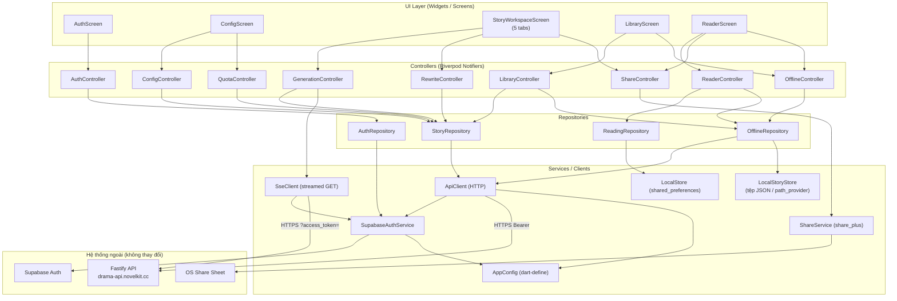
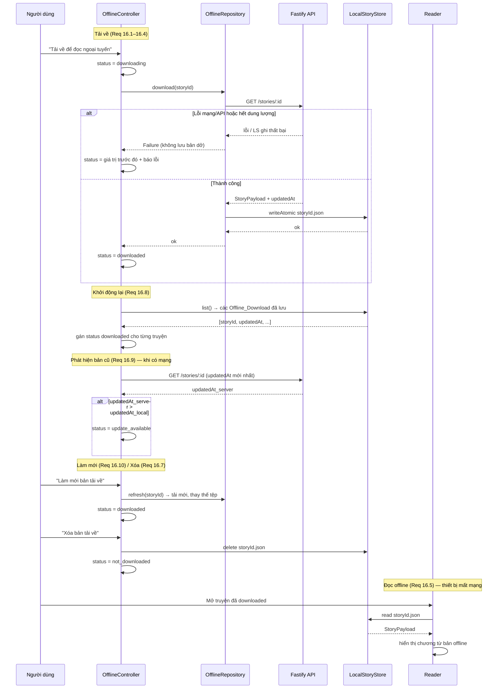
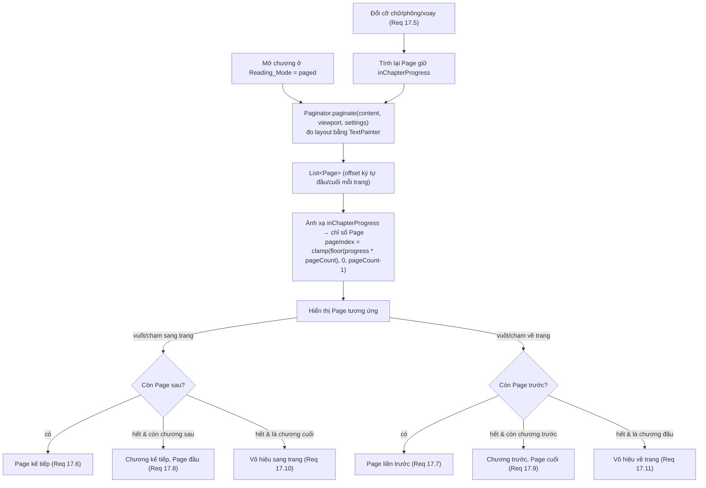
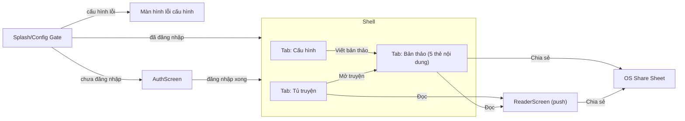

# Tài liệu Thiết kế

## Overview

Tài liệu này mô tả thiết kế kỹ thuật cho ứng dụng di động Flutter của nền tảng "Drama 15: Xưởng viết tiểu thuyết ngắn" (NovelKit Studio). Ứng dụng tái hiện đầy đủ quy trình sáng tác drama của bản web hiện tại, **sử dụng lại nguyên trạng** backend Fastify (`https://drama-api.novelkit.cc`) và Supabase Auth (Google OAuth) — **không xây dựng backend mới**. Ứng dụng được đặt tại `apps/mobile/`, song song với `apps/web` và `apps/api` trong monorepo hiện có.

Ứng dụng giữ phong cách thị giác của bản web (nền giấy ngà, màu nhấn coral, phông serif cho tiêu đề và nội dung đọc) nhưng tối ưu cho cảm ứng và màn hình nhỏ, đồng thời bổ sung các nhóm tính năng mới chỉ có trên di động: **Reader** kiểu Apple Books (gồm chế độ phân trang `paged`), **đọc ngoại tuyến bền vững** (tải truyện về máy) và **chia sẻ qua share sheet** của hệ điều hành.

Thiết kế bám sát hành vi của client web hiện có (`apps/web/src/story/StoryWorkspace.tsx`, `storyViewModel.ts`) để bảo đảm tương thích tuyệt đối với API: cùng cấu trúc `StoryConfig`, cùng tập endpoint, cùng cách xử lý sự kiện SSE, cùng vị từ "có thể viết tiếp" (`canResumeStory`), cùng định dạng Markdown xuất bản.

### Mục tiêu thiết kế

- **Tương thích API tuyệt đối**: thân yêu cầu và cách đọc phản hồi khớp 100% với những gì web đang gửi/nhận. Một bản thảo Drama 15 luôn gồm cố định `TOTAL_CHAPTERS = 15` chương.
- **SSE bền vững**: vì Dart không có `EventSource` dựng sẵn, ứng dụng triển khai một SSE client riêng dựa trên streamed HTTP GET với phân tích thủ công các khung `data:`, an toàn trước JSON lỗi và `stage` lạ, và **idempotent** khi nạp lại cùng tập sự kiện chương.
- **Trải nghiệm đọc di động**: Reader có cỡ chữ rời rạc, ba chủ đề, độ sáng, chọn phông serif/sans-serif, mục lục, tiến độ %, điều hướng chương và khôi phục vị trí đọc; hỗ trợ hai `Reading_Mode` **scroll** và **paged** (lật trang ngang kiểu Apple Books) với vị trí đọc lưu theo tỉ lệ độc lập chế độ.
- **Đọc ngoại tuyến bền vững**: tải hẳn `StoryPayload` về máy (`Local_Story_Store`), đọc lại kể cả khi mất mạng hoàn toàn hoặc sau khi khởi động lại; quản lý trạng thái tải, làm mới khi server đổi, và xóa bản tải.
- **Lưu trữ cục bộ khứ hồi**: `Reading_Settings`, `Reading_Position` và `Offline_Download` lưu/nạp tương đương (round-trip).
- **Giao diện đồng nhất web**: bảng màu, phông, ngôn ngữ tiếng Việt; reflow lưới nhiều cột của web thành điều hướng theo tab/bottom navigation.

### Quyết định công nghệ chính

| Hạng mục | Lựa chọn | Lý do tóm tắt |
|---|---|---|
| State management | **Riverpod** (`flutter_riverpod`) | Phù hợp luồng dữ liệu bất đồng bộ (auth, SSE stream, quota); `StreamProvider`/`StateNotifierProvider` mô hình hóa tự nhiên SSE và phiên đăng nhập; dễ test (override provider), không phụ thuộc `BuildContext` cho logic. Ít boilerplate hơn Bloc cho quy mô này; an toàn kiểu hơn Provider thuần. |
| Auth | **`supabase_flutter`** | SDK chính thức, hỗ trợ Google OAuth qua deep link, lưu/khôi phục phiên, refresh token tự động — tương đương `@supabase/supabase-js` mà web dùng. |
| HTTP | **`http`** | Đủ cho REST + streamed response cho SSE. Giữ nhẹ; SSE dùng `http.Client().send(Request)` lấy `StreamedResponse`. `dio` là phương án thay thế nếu sau này cần nhiều interceptor. |
| Lưu thiết lập/vị trí đọc | **`shared_preferences`** | Đủ cho `Reading_Settings` và `Reading_Position` (dữ liệu nhỏ, key-value, JSON). **Không** dùng cho `StoryPayload` lớn. |
| Lưu offline truyện (`Local_Story_Store`) | **Tệp JSON trong thư mục tài liệu app (`path_provider`)** | `StoryPayload` của 15 chương có thể lớn (hàng chục–trăm KB/truyện). `shared_preferences` không hợp lý cho payload lớn. Nhu cầu chỉ là **lưu/nạp/xóa/liệt kê theo `storyId`** một blob JSON — tệp-trên-đĩa đơn giản, đủ nhanh, dễ kiểm thử khứ hồi, không kéo theo schema/migration. **Hive** là phương án thay thế hợp lý; `LocalStoryStore` định nghĩa như interface trừu tượng nên đổi nền lưu trữ không ảnh hưởng `OfflineRepository`. |
| Chia sẻ | **`share_plus`** | Mở share sheet OS đa nền tảng, trả về `ShareResult` (phân biệt thành công/hủy). |
| Deep link OAuth | **`app_links`** (kết hợp cơ chế của `supabase_flutter`) | Bắt redirect URI sau đăng nhập Google. |
| Điều hướng | **`go_router`** | Khai báo route, hỗ trợ deep link, phù hợp cấu trúc tab/stack. |
| Phông chữ | **`google_fonts`** | Nạp phông serif (tiêu đề/nội dung) và sans (UI) đồng nhất web. |
| PBT | **`glados`** | Thư viện property-based testing cho Dart, tích hợp `package:test`; dùng cho các thuộc tính đã xác định. |

### Quyết định cho các điểm còn mở (mục "Giả định và quyết định cần xác nhận" của requirements)

1. **Nền tảng mục tiêu**: thiết kế đa nền tảng iOS + Android ngay từ đầu (một codebase). Ưu tiên kiểm thử trên iOS trước (Reader lấy cảm hứng Apple Books), nhưng không có mã riêng theo nền tảng ngoài cấu hình deep link.
2. **Deep link OAuth**: dùng custom scheme `cc.novelkit.drama15://login-callback` làm redirect URI cho di động (đăng ký trong Supabase Auth → Redirect URLs, và trong `Info.plist`/`AndroidManifest.xml`). `supabase_flutter` xử lý phần hoàn tất phiên.
3. **Đọc ngoại tuyến bền vững (Req 16)**: App **lưu bền vững** toàn bộ `StoryPayload` của truyện được chọn xuống đĩa (tệp JSON qua `path_provider`) để đọc lại kể cả khi mất mạng hoàn toàn hoặc sau khi khởi động lại. `Local_Story_Store` giữ bản tải bền vững cùng metadata (`storyId`, `title`, `updatedAt`) phục vụ phát hiện bản cũ và quản lý (xóa/làm mới).
4. **Giới hạn dung lượng tải về**: không đặt giới hạn cứng về số truyện trong phiên bản này; thay vào đó App **xử lý lỗi hết dung lượng** khi ghi tệp thất bại bằng cách giữ nguyên `Offline_Download_Status` trước đó, không để lại tệp tải dở (ghi tệp tạm rồi đổi tên nguyên tử — atomic rename), và báo lỗi (Req 16.4).
5. **Phát hiện bản cũ**: so sánh `updatedAt` của `GET /stories/:id` với `updatedAt` của `Offline_Download` đã lưu (Req 16.9); thực hiện khi mở tủ truyện lúc có mạng và khi làm mới danh sách. Bản mới hơn ⇒ đặt `update_available`.
6. **Chế độ đọc mặc định**: `Reading_Mode` mặc định là `paged` (kiểu Apple Books), lưu trong `Reading_Settings`. Người dùng có thể chuyển sang `scroll` bất kỳ lúc nào (Req 17.1–17.3).
7. **Cách phân trang `paged`**: mỗi `Page` chỉ chứa nội dung của **một** chương; chương mới luôn bắt đầu ở `Page` mới; `Page` cuối của chương có thể lấp đầy một phần màn hình (Req 17.4, 17.8, 17.9).
8. **Phạm vi chia sẻ**: chia sẻ ở dạng **văn bản (chương) và Markdown (toàn truyện)** qua share sheet; không kèm ảnh bìa/liên kết web trong phiên bản này.
9. **CORS/Origin**: client di động gọi API trực tiếp (không qua trình duyệt) nên không gắn header `Origin`; backend hiện chỉ áp CORS theo `Origin` cho preflight của trình duyệt — không cần thay đổi backend.

### Chuẩn dựng dự án (`apps/mobile`)

Dự án tổ chức theo tầng/tính năng: `lib/{config, theme, models, services, repositories, logic, controllers, screens}`.

| Thư mục (`lib/…`) | Vai trò |
|---|---|
| `config/` | App config / DI khởi tạo (`AppConfig`, providers gốc) |
| `theme/` | Design tokens, `ThemeData` |
| `models/` | Domain entities / DTO (immutable + `fromJson`/`toJson`) |
| `services/` | Data sources (HTTP, SSE, Supabase, local store, share) |
| `repositories/` | Repositories (trừu tượng hóa nguồn dữ liệu) |
| `logic/` | Hàm thuần (parser, reducer, paginator, markdown…) |
| `controllers/` | Presentation logic (Riverpod `StateNotifier`/`AsyncNotifier`) |
| `screens/` | Widgets/screens |

Cấu hình môi trường (`API_BASE_URL`, `SUPABASE_URL`, `SUPABASE_ANON_KEY`) nhúng lúc build qua `--dart-define` và kiểm bằng `AppConfig.validate()` (Req 1) — an toàn hơn đóng gói tệp `.env`. Bật `flutter_lints`; logic thuần tách khỏi I/O và UI. App **chỉ tiếng Việt** (Req 14.6) nên không dùng i18n; chuỗi UI để trực tiếp tiếng Việt.

---

## Architecture

### Tổng quan kiến trúc phân tầng

Ứng dụng theo kiến trúc phân tầng rõ ràng (UI → Controllers/Riverpod → Repositories → Services/Clients → Models), state quản lý bằng Riverpod. Mục tiêu là tách biệt **transport (HTTP/SSE)**, **logic xử lý (parser, repository, view model)** và **UI** để dễ test và bảo trì.



### Trách nhiệm từng tầng

- **UI Layer**: chỉ hiển thị state và phát sự kiện người dùng; không gọi network trực tiếp. Quan sát provider qua `ref.watch`.
- **Controllers**: `StateNotifier`/`AsyncNotifier` giữ state màn hình, điều phối repository, ánh xạ lỗi sang thông điệp tiếng Việt. Tương ứng các "Module" trong glossary (Auth_Module, Config_Module, Generation_Module, ...).
- **Repositories**: trừu tượng hóa nguồn dữ liệu (API hay local), trả về model thuần Dart; là nơi đặt logic thuần (markdown export, vị từ resume, upsert chapter) — dễ unit/property test. `OfflineRepository` điều phối giữa `ApiClient` (nạp `StoryPayload` mới nhất) và `LocalStoryStore` (lưu/nạp/xóa/liệt kê bản tải bền vững).
- **Services/Clients**: `ApiClient` (REST), `SseClient` (streamed GET + parser), `SupabaseAuthService` (phiên/token), `LocalStore` (shared_preferences cho settings/position), `LocalStoryStore` (tệp JSON trên đĩa cho `Offline_Download`), `ShareService`, `AppConfig`.
- **Models**: lớp dữ liệu bất biến (immutable) với `fromJson`/`toJson`, ánh xạ 1-1 với JSON của API.

### Khởi tạo cấu hình (Req 1)

`AppConfig` đọc ba giá trị nhúng lúc build qua `--dart-define`:

- `API_BASE_URL` (mặc định `https://drama-api.novelkit.cc`)
- `SUPABASE_URL`
- `SUPABASE_ANON_KEY`

Khi khởi động, `AppConfig.validate()` kiểm tra: `API_BASE_URL` và `SUPABASE_URL` phải là URL **HTTPS hợp lệ** (parse `Uri`, `scheme == 'https'`, có host); `SUPABASE_ANON_KEY` không rỗng. Kết quả validate là `ConfigValidation` (danh sách các khóa không hợp lệ). Một `configValidProvider` (bool) cổng (gate) mọi thao tác mạng **mới**: nếu không hợp lệ, hiển thị màn hình/thông báo lỗi cấu hình nêu rõ khóa nào hỏng (Req 1.5), chặn yêu cầu mới (Req 1.9) nhưng cho phép yêu cầu đang chạy hoàn tất (Req 1.6). Khi cả ba hợp lệ, cho phép thao tác (Req 1.7). Mọi yêu cầu đi qua HTTPS (Req 1.8).

### Luồng xác thực (Req 2)

`SupabaseAuthService` bọc `Supabase.instance.client.auth`:
- `signInWithGoogle()` gọi `signInWithOAuth(OAuthProvider.google, redirectTo: 'cc.novelkit.drama15://login-callback')` — mở trình duyệt hệ thống (Req 2.2, trong 2s).
- Deep link trả về được `supabase_flutter` xử lý, phát `onAuthStateChange` → `AuthController` cập nhật phiên và gọi `GET /auth/me` để nạp hồ sơ + quota, coi là thất bại nếu không thành công trong 10s (Req 2.3, 2.4); nếu thất bại thì giữ trạng thái đăng nhập, hiển thị "Thử lại", tự retry ≤3 lần cách 5s (Req 2.5).
- `currentAccessToken()` trả token còn hiệu lực (Supabase tự refresh); dùng cho cả header REST và query SSE.
- `restoreSession()` khôi phục phiên đã lưu khi khởi động (Req 2.9); nếu hết hiệu lực thì xóa và về trạng thái chưa đăng nhập kèm nhắc đăng nhập lại (Req 2.11).
- `signOut()` kết thúc phiên, đóng SSE đang mở, xóa state hồ sơ/quota/danh sách (Req 2.7).
- Khi chưa đăng nhập, App chặn các thao tác cần auth (gợi ý, viết, viết tiếp, đổi tên, xóa, viết lại) kèm thông báo (Req 2.8). Đăng nhập lỗi/hủy/timeout (120s) ⇒ thông báo lỗi, giữ trạng thái chưa đăng nhập (Req 2.10).

### Luồng sinh truyện qua SSE (Req 5, 6, 9)


Sự kiện chương được áp dụng qua `upsertChapterByIndex` (xóa chương cùng `index` rồi chèn lại, sort theo `index`) — bảo đảm **idempotent** khi nạp lại cùng tập sự kiện chương (Req 6.5, 5.8). Khi SSE đứt trước `done`, `GenerationController` đóng luồng, chuyển truyện sang trạng thái "cần thử lại" và hướng dẫn bấm "Viết tiếp truyện" (Req 15.2).

Viết tiếp (resume, Req 9): `GET /stories/:id` để nạp bản thảo dang dở → `POST /stories/:id/resume` → mở lại SSE để nhận các chương còn thiếu. Xử lý 409 `story_completed` (Req 9.4) / `story_not_resumable` (Req 9.5).

### Luồng đọc ngoại tuyến bền vững (Req 16)

`Local_Story_Store` lưu mỗi `Offline_Download` thành một tệp JSON riêng trong thư mục tài liệu của app (`<appDocs>/offline_stories/<storyId>.json`). Nội dung tệp gồm metadata (`storyId`, `title`, `updatedAt`) và `StoryPayload` đầy đủ. `Offline_Download_Status` được suy ra từ sự hiện diện của tệp + so sánh `updatedAt` với server.



Ghi tệp dùng **atomic rename** (ghi `<storyId>.json.tmp` rồi `rename`), nên khi đĩa đầy hoặc lỗi giữa chừng sẽ không để lại tệp tải dở (Req 16.4). `Reader` ưu tiên đọc từ `Local_Story_Store` khi truyện đã `downloaded` và thiết bị offline (Req 16.5), nếu không thì dùng `StoryPayload` đã nạp trong phiên (Req 15.5).

### Chế độ đọc phân trang kiểu Apple Books (Req 17)

`ReaderController` giữ `Reading_Mode` (mặc định `paged`). Ở chế độ `paged`, mỗi chương được chia thành danh sách `Page` vừa khít vùng hiển thị theo `Reading_Settings` (cỡ chữ, phông) và kích thước vùng đọc hiện tại. `Reading_Position` luôn lưu **theo tỉ lệ** (`chapterIndex` + `inChapterProgress` ∈ [0,1]) độc lập `Reading_Mode`, nên đổi chế độ/cỡ chữ/xoay màn hình vẫn khôi phục đúng vị trí tương đối.



Khi đổi cỡ chữ/phông/xoay (Req 17.5), `ReaderController` lưu lại `inChapterProgress` hiện tại (suy từ `Page` đang xem), tính lại danh sách `Page`, rồi ánh xạ ngược tỉ lệ → `Page` mới để giữ vị trí đọc. Khi mở lại truyện ở `paged` (Req 17.13), tiến độ tỉ lệ đã lưu được ánh xạ tới `Page` chứa vị trí tương đối đó.

### Điều hướng (Req 14)



`AppShell` dùng `BottomNavigationBar` 3 mục chính (Cấu hình, Bản thảo, Tủ truyện). Trong tab Bản thảo, năm thẻ nội dung "Chương / Ý tưởng / Dàn ý / Hồ sơ / Quan hệ" hiển thị bằng `TabBar` + `TabBarView` (Req 5.11). Reader và share sheet được mở chồng (push/modal). Lưới nhiều cột của web được reflow thành luồng một cột theo tab (Req 14.2). Phần tử chạm tối thiểu ~48 logical px (Req 14.4); dùng `MediaQuery`/`LayoutBuilder` cho xoay màn hình (Req 14.5).

---

## Components and Interfaces

### AppConfig (Config hạ tầng — Req 1)

```dart
class AppConfig {
  final String apiBaseUrl;      // từ --dart-define API_BASE_URL
  final String supabaseUrl;     // từ --dart-define SUPABASE_URL
  final String supabaseAnonKey; // từ --dart-define SUPABASE_ANON_KEY

  ConfigValidation validate();  // kiểm tra HTTPS + non-empty
  bool get isValid;
}

class ConfigValidation {
  final List<String> invalidKeys; // ví dụ: ['API_BASE_URL']
  bool get isValid => invalidKeys.isEmpty;
}

/// Hàm thuần: chuỗi là URL HTTPS hợp lệ (Uri.tryParse, scheme=='https', host khác rỗng).
bool validateHttpsUrl(String value);
```

### SupabaseAuthService (Auth_Module — Req 2)

```dart
abstract class SupabaseAuthService {
  Stream<AuthSessionState> get authStateChanges;
  AuthSession? get currentSession;
  Future<String?> currentAccessToken();         // null nếu không có token hiệu lực
  Future<void> signInWithGoogle();              // mở OAuth, redirect deep link
  Future<void> signOut();
  Future<AuthSession?> restoreSession();         // khi khởi động
}
```

### ApiClient (API_Client — Req 1, 15)

```dart
class ApiClient {
  ApiClient(this._config, this._auth, this._httpClient, this._configGate);

  // Gắn Authorization: Bearer <token> cho endpoint cần auth (Req 1.3).
  // Mọi request đi qua HTTPS (Req 1.8). Chặn nếu config không hợp lệ (Req 1.9)
  // hoặc thiếu token cho endpoint cần auth (Req 1.10).
  Future<ApiResponse<T>> get<T>(String path, {bool authRequired = true, T Function(Map<String,dynamic>)? decode});
  Future<ApiResponse<T>> post<T>(String path, {Object? body, bool authRequired = true});
  Future<ApiResponse<T>> patch<T>(String path, {Object? body});
  Future<ApiResponse<void>> delete(String path);

  // Hàm thuần: dựng Uri HTTPS từ apiBaseUrl + path tương đối.
  static Uri buildUri(String baseUrl, String path);
}
```

`ApiResponse<T>` là union: `ApiSuccess<T>(data, httpStatus)` hoặc `ApiFailure(kind, message, code?, httpStatus?)` với `ApiFailureKind { network, unauthorized, quota, validation, notFound, conflict, server, config }`. `message` lấy từ `error.message` của body khi có (Req 15.3); `code` lấy từ `error.code` (phân biệt `quota_exceeded`, `setup_suggestion_quota_exceeded`, `story_completed`, `story_not_resumable`). HTTP 401 → `unauthorized` → nhắc đăng nhập lại (Req 15.4). Lỗi mạng (SocketException/timeout) → `network`, giữ nguyên dữ liệu hiển thị (Req 15.1).

### SseClient + SseParser (SSE_Parser — Req 5, 6)

Dart không có `EventSource`. Triển khai SSE bằng streamed HTTP GET và phân tích thủ công khung `data:`.

```dart
class SseClient {
  // Mở GET /stories/:id/stream?access_token=<urlEncoded> qua HTTPS.
  // Trả về Stream<StreamEvent> đã được parse & lọc.
  Stream<StreamEvent> connect(String storyId, {required String accessToken});
  void close();

  // Hàm thuần: dựng Uri stream HTTPS, mã hóa access_token vào query.
  static Uri buildStreamUri(String baseUrl, String storyId, String accessToken);
}

/// Hàm thuần, dễ test.
class SseParser {
  /// Parse một "event block": ghép các dòng "data:", parse JSON.
  /// Trả null nếu JSON không hợp lệ (Req 6.3) hoặc stage không hợp lệ (Req 6.4).
  static StreamEvent? parseFrame(String rawEventBlock);

  /// Tách buffer luỹ kế thành (danh sách block hoàn chỉnh, phần dư còn lại).
  static (List<String> blocks, String remainder) splitBuffer(String buffer);
}
```

Chi tiết phân tích:
- Đọc `response.stream.transform(utf8.decoder)`, tích lũy vào buffer; tách theo `\n\n` (ranh giới sự kiện SSE). Phần chưa đủ một block giữ làm remainder.
- Trong mỗi block, lấy các dòng bắt đầu bằng `data:`, bỏ tiền tố, nối bằng `\n` (chuẩn SSE).
- `jsonDecode` trong `try/catch`: lỗi → `null` (bỏ qua, không dừng luồng).
- Đọc trường `stage`; nếu không thuộc tập hợp lệ `{progress, overview, bible, plan, relationshipGraph, chapter, done, error}` → `null` (Req 6.2, 6.4).
- Map còn lại thành `StreamEvent` (xem Data Models).

`SseClient` không tự reduce state; chỉ phát `StreamEvent`. `GenerationController` áp dụng reducer thuần `reduceStream(StoryWorkspaceState, StreamEvent) -> StoryWorkspaceState`, giúp test reducer độc lập (kể cả idempotency chương).

### StoryRepository (Config/Suggest/Generation/Library/Rewrite/Quota)

```dart
class StoryRepository {
  Future<ApiResponse<List<StylePreset>>> getStylePresets();          // Req 3.4/3.5
  Future<ApiResponse<AccountSnapshot>> getAuthMe();                  // Req 2.4, 7.5
  Future<ApiResponse<SetupSuggestion>> setupSuggest(StoryConfig c);  // Req 4
  Future<ApiResponse<List<SavedStory>>> listStories();               // Req 8.1
  Future<ApiResponse<CreateStoryResult>> createStory(StoryConfig c); // Req 5.1, 7.4
  Future<ApiResponse<StoryDetail>> getStory(String id);              // Req 8.3, 9.3
  Future<ApiResponse<ResumeResult>> resumeStory(String id);          // Req 9.3-9.5
  Future<ApiResponse<RewriteResult>> rewriteChapter(String id, RewriteRequest r); // Req 10
  Future<ApiResponse<SavedStory>> renameStory(String id, String title); // Req 8.4
  Future<ApiResponse<void>> deleteStory(String id);                  // Req 8.5

  // Hàm thuần (logic), tách khỏi network:
  static bool canResumeStory(SavedStory s);                          // Req 9.1
  static List<Chapter> upsertChapterByIndex(List<Chapter> existing, Chapter next); // Req 6.5
  static String buildStoryMarkdown(String title, StoryPayload payload); // Req 13.2, 13.3
  static String buildChapterShareText(String title, Chapter chapter);   // Req 13.1
}
```

`canResumeStory` ánh xạ chính xác hàm web (`storyViewModel.ts`): `status != 'completed' && (canResume == true || (chapterCount > 0 && chapterCount < TOTAL_CHAPTERS))`.

Endpoint khớp web: `GET /story/style-presets`, `GET /auth/me`, `POST /story/setup-suggest`, `GET /stories`, `POST /stories`, `GET /stories/:id`, `POST /stories/:id/resume`, `POST /stories/:id/rewrite`, `PATCH /stories/:id`, `DELETE /stories/:id`.

### ReadingRepository + LocalStore (Reader persistence — Req 12)

```dart
class ReadingRepository {
  Future<ReadingSettings> loadSettings();                 // Req 12.2
  Future<void> saveSettings(ReadingSettings s);           // Req 12.1
  Future<ReadingPosition?> loadPosition(String storyId);  // Req 12.4, 12.7
  Future<void> savePosition(String storyId, ReadingPosition p); // Req 12.3
}
```

`LocalStore` bọc `shared_preferences`, lưu JSON. Khóa: `reading_settings` (toàn cục) và `reading_position:<storyId>` (theo truyện). (De)serialize qua `ReadingSettings.toJson/fromJson` và `ReadingPosition.toJson/fromJson` — tâm điểm của hai thuộc tính khứ hồi (Req 12.5, 12.6).

### LocalStoryStore + OfflineRepository (Local_Story_Store — Req 16)

```dart
abstract class LocalStoryStore {
  /// Lưu (ghi đè) một Offline_Download. Ghi tệp tạm + rename nguyên tử để
  /// không để lại tệp tải dở khi đĩa đầy/lỗi (Req 16.4). Ném StorageFullException khi hết dung lượng.
  Future<void> save(OfflineDownload download);
  /// Nạp Offline_Download của một truyện; null nếu chưa tải (Req 16.5, 16.8).
  Future<OfflineDownload?> load(String storyId);
  /// Xóa bản tải (Req 16.7). No-op nếu không tồn tại.
  Future<void> delete(String storyId);
  /// Liệt kê metadata các bản đã tải (không nạp toàn bộ payload) — khôi phục khi khởi động (Req 16.8).
  Future<List<OfflineDownloadMeta>> list();
}

class OfflineRepository {
  OfflineRepository(this._api, this._store);

  /// Nạp StoryPayload mới nhất qua GET /stories/:id rồi lưu vào store.
  /// Trả ApiFailure nếu lỗi mạng/API; KHÔNG ghi bản dở (Req 16.1, 16.4, 16.10).
  Future<ApiResponse<OfflineDownload>> download(String storyId);
  Future<OfflineDownload?> loadOffline(String storyId);   // Req 16.5
  Future<void> remove(String storyId);                    // Req 16.7
  Future<List<OfflineDownloadMeta>> listDownloaded();     // Req 16.8

  // Hàm thuần (logic), tách khỏi I/O:
  static bool isUpdateAvailable(String localUpdatedAt, String serverUpdatedAt); // Req 16.9
  static OfflineDownloadStatus deriveStatus({
    required bool isDownloaded,
    required bool isDownloading,
    String? localUpdatedAt,
    String? serverUpdatedAt,
  });
}
```

`OfflineRepository.download` đảm bảo khứ hồi: `StoryPayload` lưu xuống rồi nạp lại phải tương đương về nhan đề và toàn bộ chương theo `index` tăng dần (Req 16.11).

### OfflineController (Offline_Download_Status — Req 16)

```dart
class OfflineController extends StateNotifier<Map<String, OfflineDownloadStatus>> {
  Future<void> downloadStory(String storyId);            // downloading → downloaded / rollback (Req 16.1–16.4)
  Future<void> refreshStory(String storyId);             // update_available → downloaded (Req 16.10)
  Future<void> deleteDownload(String storyId);           // → not_downloaded (Req 16.7)
  Future<void> restoreOnStartup();                       // nạp list() → downloaded (Req 16.8)
  Future<void> checkForUpdates(List<SavedStory> remote); // gán update_available khi online (Req 16.9)
  OfflineDownloadStatus statusOf(String storyId);
}
```

Khi tải lỗi (mạng/API/hết dung lượng), controller **giữ nguyên** trạng thái trước đó và phát thông điệp lỗi tiếng Việt (Req 16.4). `LibraryController` quan sát `OfflineController` để hiển thị `Offline_Download_Status` cùng hành động "Tải về / Xóa bản tải về / Làm mới bản tải về" cho mỗi truyện (Req 16.6) và mở Reader ở chế độ offline khi phù hợp (Req 16.5).

### AuthController + QuotaController + ConfigController + LibraryController + RewriteController + GenerationController

```dart
class AuthController extends StateNotifier<AuthState> {
  Future<void> signInWithGoogle();        // Req 2.1, 2.2, 2.10
  Future<void> onAuthChanged(AuthSession? s); // hoàn tất phiên + nạp /auth/me (Req 2.3, 2.4)
  Future<void> retryLoadProfile();        // "Thử lại" + auto retry ≤3 lần/5s (Req 2.5)
  Future<void> signOut();                 // Req 2.7
  Future<void> restoreOnStartup();        // Req 2.9, 2.11
}

class QuotaController extends StateNotifier<QuotaState> {
  void applyStoryQuota(QuotaSnapshot q);            // Req 7.1, 7.5
  void applySuggestionQuota(QuotaSnapshot q);       // Req 7.2, 4.3
  bool get canCreateStory;                          // remaining > 0 (Req 7.3)
  bool get canSuggest;                              // remaining > 0 (Req 4.5)
}

class ConfigController extends StateNotifier<StoryConfig> {
  Future<void> loadStylePresets();        // Req 3.4, fallback 3.5
  Future<void> suggest();                 // Req 4.1, 4.2, 4.4, 4.6
  void update(...);                       // niche/custom/sliders/language (Req 3.x)
}

class LibraryController extends StateNotifier<LibraryState> {
  Future<void> load();                    // Req 8.1, 8.6
  Future<void> open(String id);           // Req 8.3
  Future<void> rename(String id, String title); // Req 8.4
  Future<void> delete(String id);         // Req 8.5
}

class RewriteController extends StateNotifier<RewriteState> {
  bool get canSubmit;                     // instruction không rỗng (Req 10.5)
  Future<void> submit(String id);         // Req 10.3, 10.4, 10.6
}

class GenerationController extends StateNotifier<StoryWorkspaceState> {
  Future<void> createAndStream(StoryConfig c);  // Req 5.1, 5.2, 5.10
  Future<void> resumeAndStream(String id);      // Req 9.3-9.5
  void onEvent(StreamEvent e);                  // reduceStream (Req 5.3-5.9)
  void onStreamBroken();                        // Req 15.2
  void close();
}
```

### ReaderController + Paginator (Reader — Req 11, 12, 17)

Giữ `ReaderState`: `chapters` (sort tăng theo `index`), `currentChapterIndex`, `inChapterProgress` (0..1), `settings` (gồm `Reading_Mode`), và ở chế độ `paged` thêm `pages` (danh sách `Page` của chương hiện tại) + `currentPageIndex`. Cung cấp:
- `goToChapter(int index)`, `nextChapter()`, `prevChapter()` với vô hiệu hóa ở biên (Req 11.8, 11.11, 11.12).
- `updateSettings(...)` áp dụng tức thời ≤1s (Req 11.10) và lưu (Req 12.1); đổi `Reading_Mode` áp dụng ngay không rời Reader (Req 17.2) và lưu vào `Reading_Settings` (Req 17.3).
- `progressPercent()`: hàm thuần tính % theo chương hiện tại + tiến độ trong chương trên tổng số chương (Req 11.7).
- Khôi phục `Reading_Position` khi mở (Req 11.9, 12.4); mở ở chương đầu nếu chưa có (Req 12.7).
- Cỡ chữ rời rạc (≥5 bước, 12–28, mặc định 18), ba chủ đề light/sepia/dark, độ sáng 0..1, phông serif/sans (Req 11.2–11.5); mục lục theo `index` tăng (Req 11.6).

Điều hướng theo trang (chế độ `paged`):
- `nextPage()` / `prevPage()`: sang `Page` kế/liền trước trong chương (Req 17.6, 17.7); vượt biên chương thì chuyển chương kế và về `Page` đầu (Req 17.8) hoặc chương trước và tới `Page` cuối (Req 17.9); vô hiệu khi ở `Page` cuối của chương cuối (Req 17.10) hoặc `Page` đầu của chương đầu (Req 17.11).
- `recomputePages(Size viewport)`: gọi `Paginator.paginate` khi đổi cỡ chữ/phông/xoay (Req 17.5), giữ `inChapterProgress` rồi ánh xạ lại sang `currentPageIndex`.

```dart
class Paginator {
  /// Chia nội dung chương thành các Page vừa khít viewport theo settings.
  /// Đo layout bằng TextPainter (cùng TextStyle: cỡ chữ, phông, line-height)
  /// và kích thước vùng đọc; cắt theo ranh giới dòng để không vỡ chữ.
  static List<Page> paginate(String content, Size viewport, ReadingSettings settings);

  /// inChapterProgress (0..1) → chỉ số Page.
  static int progressToPageIndex(double progress, int pageCount) =>
      pageCount <= 1 ? 0 : (progress * pageCount).floor().clamp(0, pageCount - 1);

  /// chỉ số Page → inChapterProgress đại diện (đầu trang).
  static double pageIndexToProgress(int pageIndex, int pageCount) =>
      pageCount <= 0 ? 0.0 : (pageIndex / pageCount).clamp(0.0, 1.0);
}

class Page { final int startOffset; final int endOffset; } // offset ký tự trong content chương
```

**Thuật toán phân trang**: dùng `TextPainter` với `maxWidth` = bề rộng vùng đọc và `TextStyle` dựng từ `Reading_Settings`. Lần lượt thêm dòng cho tới khi `painter.height` vượt chiều cao vùng đọc thì chốt một `Page` tại ranh giới dòng gần nhất, rồi bắt đầu `Page` kế từ offset đó. Mỗi `Page` chỉ thuộc một chương; chương mới luôn mở `Page` mới (Req 17.4). Phụ thuộc `viewport` + `settings` nên mọi thay đổi cỡ chữ/phông/xoay đều kích hoạt `recomputePages` (Req 17.5).

### ShareService + ShareController (Share_Module — Req 13)

```dart
abstract class ShareService {
  Future<ShareOutcome> shareText(String text, {String? subject}); // ShareOutcome { success, dismissed, failure }
}
```

`ShareController` quyết định bật/tắt thao tác: tắt chia sẻ toàn truyện khi `chapterCount == 0` (Req 13.4), tắt chia sẻ chương khi nội dung rỗng (Req 13.5). Dùng `buildStoryMarkdown` (Req 13.2, 13.3) / `buildChapterShareText` (Req 13.1). Xử lý `dismissed` (không báo lỗi, Req 13.7) và `failure` (báo lỗi, giữ màn hình, Req 13.6). Mở share sheet trong 2s (Req 13.1, 13.2).

### Theme (giao diện — Req 14)

`AppTheme` định nghĩa `ThemeData` ánh xạ token CSS của web:
- Màu: `pageBg #f1e9d8`, `paper #fbf7ee`, `canvas #fdfaf3`, `ink #1a1611`, `muted #6b6253`, `coral #d7634e`, `coralDark #b9452f`.
- Phông: serif (tiêu đề và nội dung đọc); sans (UI). Nhúng qua `google_fonts`.
- Kích thước chạm tối thiểu ~48 logical px (Req 14.4); `MediaQuery`/`LayoutBuilder` cho xoay/reflow (Req 14.5).

Reader có hệ màu riêng theo `ReaderTheme { light, sepia, dark }` (Req 11.3), độc lập theme app, kèm lớp phủ độ sáng (Req 11.4).

---

## Data Models

Mọi model là lớp **bất biến** (immutable) với `fromJson`/`toJson`, ánh xạ **1-1** với JSON của API hiện có (xem `apps/web` để đối chiếu cấu trúc). Quy ước: trường tùy chọn dùng kiểu nullable; bộ sưu tập mặc định rỗng thay vì null khi parse.

### StoryConfig (Config_Module — Req 3, 4, 5)

```dart
class StoryConfig {
  final String niche;            // một trong 13 mã niche (gồm 'custom')
  final String? customNiche;     // chỉ khi niche == 'custom'
  final String title;            // được phép rỗng
  final String seed;             // được phép rỗng
  final String outputLanguage;   // vietnamese|english|japanese|korean|spanish|portuguese (mặc định vietnamese)
  final double intensity;        // 0..1, mặc định 0.84
  final double dialogueRatio;    // 0.2..0.85, mặc định 0.56
  final double hookDensity;      // 0..1, mặc định 0.67
  final String stylePreset;      // mã giọng kể; fallback 'co_man_warm_modern_blueprint'
  final StoryControls? storyControls; // tùy chọn (từ gợi ý kịch bản)

  Map<String, dynamic> toJson();          // thân request khớp API (Req 3.10)
  factory StoryConfig.fromJson(Map<String, dynamic> json);
  StoryConfig copyWith({...});
}

class StoryControls {
  final Map<String, dynamic> raw; // giữ nguyên cấu trúc story controls do API trả về (Req 4.2)
  Map<String, dynamic> toJson();
  factory StoryControls.fromJson(Map<String, dynamic> json);
}
```

`niche` nhận đúng 13 mã (Req 3.1): `billionaire_rich_poor_romance`, `humiliation_revenge_justice`, `secret_identity_hidden_heiress`, `toxic_family_betrayal`, `cheating_ex_wedding_drama`, `single_mom_poor_woman_comeback`, `social_injustice_discrimination_drama`, `workplace_ceo_power_struggle`, `medical_hidden_doctor_life_care`, `school_campus_bullying_identity`, `werewolf_luna_alpha_soulmate`, `steamy_alien_captive_romance`, `custom`. Mỗi mã ánh xạ một nhãn tiếng Việt trong bảng `nicheLabels` (hàm thuần, không nằm trong model).

### StylePreset (Req 3.4, 3.5)

```dart
class StylePreset {
  final String id;     // ví dụ 'co_man_warm_modern_blueprint'
  final String label;  // nhãn hiển thị
  factory StylePreset.fromJson(Map<String, dynamic> json);
}
```

### SetupSuggestion (Suggest_Module — Req 4)

```dart
class SetupSuggestion {
  final String title;
  final String seed;
  final StoryControls? storyControls;
  final QuotaSnapshot? setupSuggestionQuota; // Req 4.3
  factory SetupSuggestion.fromJson(Map<String, dynamic> json);
}
```

### StreamEvent (SSE_Parser — Req 5, 6)

`StreamEvent` là **sealed union** theo `stage`. `SseParser.parseFrame` trả `null` cho JSON lỗi (Req 6.3) hoặc `stage` ngoài tập hợp lệ (Req 6.4).

```dart
sealed class StreamEvent {
  final String stage;
}

class ProgressEvent extends StreamEvent {        // stage: progress (Req 5.3)
  final int current;
  final int total;
  final String? detail;
  final String? label;
}
class OverviewEvent extends StreamEvent {         // stage: overview (Req 5.4)
  final String title;
  final String concept;
}
class BibleEvent extends StreamEvent {            // stage: bible (Req 5.5)
  final Map<String, dynamic> storyBible;
}
class PlanEvent extends StreamEvent {             // stage: plan (Req 5.6)
  final List<dynamic> chapterPlan;
}
class RelationshipGraphEvent extends StreamEvent {// stage: relationshipGraph (Req 5.7)
  final Map<String, dynamic> relationshipGraph;
}
class ChapterEvent extends StreamEvent {          // stage: chapter (Req 5.8)
  final Chapter chapter;                          // mang index
}
class DoneEvent extends StreamEvent {}            // stage: done (Req 5.9)
class StreamErrorEvent extends StreamEvent {      // stage: error (Req 6.2, 15.2)
  final String? message;
}

const kValidStages = {
  'progress','overview','bible','plan','relationshipGraph','chapter','done','error'
};
```

### Chapter & StoryPayload (Reader/Offline — Req 5, 11, 13, 16)

```dart
class Chapter {
  final int index;        // khóa sắp xếp/định danh chương
  final String title;     // tiêu đề chương
  final String content;   // toàn bộ văn bản chương (có thể rỗng khi đang sinh)
  factory Chapter.fromJson(Map<String, dynamic> json);
  Map<String, dynamic> toJson();
}

class StoryPayload {
  final String title;
  final String? concept;
  final Map<String, dynamic>? storyBible;
  final List<dynamic>? chapterPlan;
  final List<Chapter> chapters;                 // luôn giữ sort theo index tăng dần
  final Map<String, dynamic>? relationshipGraph;
  factory StoryPayload.fromJson(Map<String, dynamic> json);
  Map<String, dynamic> toJson();                // round-trip (Req 16.11)
}
```

`StoryPayload.fromJson` luôn sort `chapters` theo `index` tăng dần; `toJson` giữ thứ tự đó — nền tảng cho thuộc tính khứ hồi offline (Req 16.11).

### SavedStory & StoryDetail (Library_Module — Req 8, 9)

```dart
class SavedStory {
  final String id;
  final String title;
  final StoryStatus status;     // queued|running|completed|failed
  final String createdAt;       // ISO-8601
  final String updatedAt;       // ISO-8601 (so sánh phát hiện bản cũ — Req 16.9)
  final int chapterCount;
  final bool canResume;
  final String? error;
  factory SavedStory.fromJson(Map<String, dynamic> json);
}

enum StoryStatus { queued, running, completed, failed }

class StoryDetail {
  final SavedStory meta;
  final StoryPayload payload;
  factory StoryDetail.fromJson(Map<String, dynamic> json);
}
```

Nhãn trạng thái tiếng Việt (hàm thuần `statusLabel`): `queued`→"Đang chờ", `running`→"Đang viết", `completed`→"Hoàn tất", `failed`→"Có lỗi" (Req 8.2).

### Kết quả các thao tác sinh truyện (Req 5, 9, 10)

```dart
class CreateStoryResult {           // 201 POST /stories (Req 5.2)
  final String storyId;
  final StoryStatus status;
  final QuotaSnapshot? quota;       // Req 7.4, 7.5
}
class ResumeResult {                // POST /stories/:id/resume (Req 9.3)
  final String storyId;
  final StoryStatus status;
}
class RewriteRequest {              // body POST /stories/:id/rewrite (Req 10.3)
  final int chapterIndex;
  final RewriteMode mode;
  final String instruction;         // không rỗng (Req 10.3, 10.5)
  Map<String, dynamic> toJson();
}
enum RewriteMode {                  // Req 10.2
  full_chapter, opening_hook, closing_beat,
  dialogue_tone, class_humiliation, retaliation_sharpness
}
class RewriteResult {               // Req 10.4
  final Chapter chapter;
  final Map<String, dynamic>? relationshipGraph;
}
```

Nhãn tiếng Việt cho `RewriteMode` qua hàm thuần `rewriteModeLabel` (Req 10.2).

### Tài khoản & Hạn mức (Auth/Quota — Req 2, 7)

```dart
class AccountSnapshot {             // GET /auth/me (Req 2.4, 2.6)
  final String? displayName;
  final String email;
  final PlanTier plan;              // free|pro|premium
  final QuotaSnapshot storyQuota;            // Story_Quota
  final QuotaSnapshot? setupSuggestionQuota; // Setup_Suggestion_Quota
  factory AccountSnapshot.fromJson(Map<String, dynamic> json);
}
enum PlanTier { free, pro, premium }          // nhãn: Miễn phí|Pro|Premium (Req 2.6)

class QuotaSnapshot {
  final int remaining;
  final int limit;
  String get display => 'còn $remaining/$limit'; // Req 7.1
  factory QuotaSnapshot.fromJson(Map<String, dynamic> json);
}
```

### Reading_Settings & Reading_Position (Reader persistence — Req 11, 12, 17)

```dart
class ReadingSettings {
  final double fontSize;        // 12..28, mặc định 18 (≥5 bước rời rạc — Req 11.2)
  final FontFamilyChoice fontFamily; // serif|sans (Req 11.5)
  final ReaderTheme theme;      // light|sepia|dark (Req 11.3)
  final double brightness;      // 0..1, mặc định 1 (Req 11.4)
  final ReadingMode mode;       // scroll|paged, mặc định paged (Req 17.1)
  Map<String, dynamic> toJson();                 // round-trip (Req 12.5)
  factory ReadingSettings.fromJson(Map<String, dynamic> json);
  static const fontSizeSteps = [12.0, 14.0, 16.0, 18.0, 20.0, 24.0, 28.0];
}
enum FontFamilyChoice { serif, sans }
enum ReaderTheme { light, sepia, dark }
enum ReadingMode { scroll, paged }

class ReadingPosition {
  final int chapterIndex;       // chương hiện tại
  final double inChapterProgress; // 0..1, tỉ lệ trong chương (độc lập Reading_Mode — Req 17.12)
  Map<String, dynamic> toJson();                 // round-trip (Req 12.6)
  factory ReadingPosition.fromJson(Map<String, dynamic> json);
}
```

`inChapterProgress` luôn được kẹp về [0,1]; `fromJson` clamp giá trị đọc lên để bảo toàn bất biến.

### Offline_Download & trạng thái (Local_Story_Store — Req 16)

```dart
class OfflineDownload {
  final String storyId;
  final String title;
  final String updatedAt;       // ISO-8601, mốc so sánh bản cũ (Req 16.9)
  final StoryPayload payload;   // toàn bộ chương
  Map<String, dynamic> toJson();                 // round-trip (Req 16.11)
  factory OfflineDownload.fromJson(Map<String, dynamic> json);
}

class OfflineDownloadMeta {     // metadata nhẹ, không nạp payload (Req 16.8)
  final String storyId;
  final String title;
  final String updatedAt;
}

enum OfflineDownloadStatus { not_downloaded, downloading, downloaded, update_available } // Req 16
```

### ApiResponse (kết quả gọi API — Req 15)

```dart
sealed class ApiResponse<T> {}
class ApiSuccess<T> extends ApiResponse<T> { final T data; final int httpStatus; }
class ApiFailure<T> extends ApiResponse<T> {
  final ApiFailureKind kind;
  final String message;   // ưu tiên error.message của body (Req 15.3)
  final String? code;     // error.code: quota_exceeded, setup_suggestion_quota_exceeded, story_completed, story_not_resumable
  final int? httpStatus;
}
enum ApiFailureKind { network, unauthorized, quota, validation, notFound, conflict, server, config }
```

---

## Correctness Properties

*Một thuộc tính (property) là đặc trưng hoặc hành vi phải luôn đúng trên mọi lần thực thi hợp lệ của hệ thống — về bản chất là một phát biểu hình thức về điều phần mềm phải làm. Property là cầu nối giữa đặc tả con người đọc được và những bảo đảm đúng đắn máy kiểm chứng được.*

PBT **áp dụng có chọn lọc**. Các thuộc tính dưới đây nhắm vào **logic thuần** (hàm không I/O) đã tách ra trong các tầng `logic/`, `models/` và phần tĩnh (`static`) của `services/`: parser SSE, reducer, paginator, serialize/deserialize, vị từ resume, suy diễn trạng thái offline, dựng URL. Đây là nơi không gian đầu vào lớn, có bất biến/khứ hồi rõ ràng, đáng chạy ≥100 vòng. Các tiêu chí phụ thuộc Supabase, HTTP I/O, file I/O, OS share sheet hay thuần UI được kiểm bằng unit/widget/integration test (xem Testing Strategy), **không** dùng PBT. Sau bước prework và phản chiếu loại trùng, danh sách property cô đọng còn 18 thuộc tính.

### Property 1: validateHttpsUrl chỉ chấp nhận URL HTTPS hợp lệ

*For any* chuỗi đầu vào, `validateHttpsUrl(s)` trả `true` khi và chỉ khi `s` parse được thành `Uri` có `scheme == 'https'` và `host` khác rỗng; mọi chuỗi rỗng, thiếu scheme, dùng `http`, hoặc không có host đều trả `false`.

**Validates: Requirements 1.1, 1.2**

### Property 2: AppConfig hợp lệ khi và chỉ khi cả ba giá trị hợp lệ

*For any* tổ hợp ba giá trị `(API_BASE_URL, SUPABASE_URL, SUPABASE_ANON_KEY)`, `AppConfig.validate()` trả về `invalidKeys` đúng bằng tập các khóa không hợp lệ (hai URL không phải HTTPS có host, hoặc anon key rỗng), và `isValid` đúng bằng (`invalidKeys` rỗng).

**Validates: Requirements 1.5, 1.7, 1.9**

### Property 3: Mọi URI gọi API đều dùng HTTPS

*For any* `baseUrl` HTTPS hợp lệ, mọi `path` tương đối, `storyId` và `accessToken`, cả `ApiClient.buildUri(baseUrl, path)` lẫn `SseClient.buildStreamUri(baseUrl, storyId, accessToken)` đều trả về `Uri` có `scheme == 'https'` và giữ nguyên host của base.

**Validates: Requirements 1.8**

### Property 4: access_token khứ hồi qua query của stream URI

*For any* `storyId` và mọi chuỗi `accessToken` (gồm ký tự đặc biệt cần mã hóa URL), `SseClient.buildStreamUri(baseUrl, storyId, accessToken).queryParameters['access_token']` giải mã ra đúng `accessToken` ban đầu.

**Validates: Requirements 1.4**

### Property 5: Endpoint cần auth luôn gắn Bearer token

*For any* token không rỗng, request dựng cho một endpoint cần xác thực luôn chứa header `Authorization` với giá trị đúng bằng `'Bearer ' + token`.

**Validates: Requirements 1.3**

### Property 6: StoryConfig khứ hồi qua JSON

*For any* `StoryConfig` hợp lệ, `StoryConfig.fromJson(c.toJson())` cho ra một cấu hình tương đương `c` trên mọi trường (gồm `storyControls` tùy chọn).

**Validates: Requirements 3.10**

### Property 7: reduceStream ánh xạ đúng từng loại sự kiện SSE

*For any* trạng thái workspace và một `StreamEvent` không phải `chapter`, `reduceStream(state, event)` chỉ cập nhật đúng phần state tương ứng loại sự kiện (`progress`→tiến độ theo `current`/`total` + nhãn, `overview`→nhan đề+concept, `bible`→story bible, `plan`→dàn ý, `relationshipGraph`→đồ thị, `done`→100% + phase completed) và không làm hỏng các phần state khác.

**Validates: Requirements 5.3, 5.4, 5.5, 5.6, 5.7, 5.9**

### Property 8: Áp sự kiện chương là idempotent, duy nhất theo index và sắp tăng

*For any* danh sách chương ban đầu và mọi dãy `ChapterEvent` (các `index` có thể trùng), áp dãy qua `upsertChapterByIndex` **một lần** cho kết quả bằng với áp **hai lần** (idempotent); danh sách chương kết quả luôn được sắp tăng theo `index` và không có hai chương trùng `index` (chương sau ghi đè chương trước cùng `index`).

**Validates: Requirements 5.8, 6.5**

### Property 9: SseParser.parseFrame trả đúng loại với đầu vào hợp lệ

*For any* `stage` trong tập hợp lệ `kValidStages` và thân JSON hợp lệ tương ứng, `SseParser.parseFrame` trả về một `StreamEvent` non-null đúng loại với `stage` đó.

**Validates: Requirements 6.1, 6.2**

### Property 10: SseParser.parseFrame an toàn trước đầu vào bất thường

*For any* khối sự kiện chứa JSON không hợp lệ hoặc `stage` ngoài `kValidStages`, `SseParser.parseFrame` trả về `null` và **không bao giờ ném ngoại lệ** (luồng không bị dừng, trạng thái truyện được giữ nguyên).

**Validates: Requirements 6.3, 6.4**

### Property 11: Hiển thị hạn mức đúng định dạng

*For any* cặp số nguyên `remaining`, `limit`, `QuotaSnapshot(remaining, limit).display == 'còn $remaining/$limit'`.

**Validates: Requirements 7.1**

### Property 12: canResumeStory khớp công thức của bản web

*For any* `SavedStory`, `canResumeStory(s)` đúng bằng `s.status != completed && (s.canResume || (s.chapterCount > 0 && s.chapterCount < TOTAL_CHAPTERS))`.

**Validates: Requirements 9.1**

### Property 13: Tiến độ đọc luôn trong [0,100] và đơn điệu theo vị trí

*For any* `(chapterIndex, inChapterProgress, totalChapters)` hợp lệ, `progressPercent` cho giá trị trong khoảng [0, 100]; và với hai vị trí trên cùng một truyện, vị trí "xa hơn" (chương lớn hơn, hoặc cùng chương nhưng `inChapterProgress` lớn hơn) cho phần trăm **không nhỏ hơn** vị trí kia.

**Validates: Requirements 11.7**

### Property 14: Reading_Settings khứ hồi lưu/nạp

*For any* `ReadingSettings` (gồm cả `Reading_Mode`), `ReadingSettings.fromJson(s.toJson())` cho ra thiết lập tương đương `s`.

**Validates: Requirements 12.5, 17.3**

### Property 15: Reading_Position khứ hồi lưu/nạp

*For any* `ReadingPosition` với `inChapterProgress` ∈ [0,1], `ReadingPosition.fromJson(p.toJson())` cho ra vị trí tương đương `p`.

**Validates: Requirements 12.6, 17.12**

### Property 16: Markdown bản thảo gồm nhan đề và toàn bộ chương theo index tăng

*For any* `StoryPayload`, chuỗi `buildStoryMarkdown(title, payload)` chứa nhan đề truyện và tiêu đề + nội dung của **mọi** chương, xuất hiện theo đúng thứ tự `index` tăng dần.

**Validates: Requirements 13.2, 13.3**

### Property 17: Suy diễn Offline_Download_Status nhất quán

*For any* tổ hợp `(isDownloaded, isDownloading, localUpdatedAt, serverUpdatedAt)`, `deriveStatus` trả đúng: `downloading` khi đang tải; `not_downloaded` khi chưa tải; `update_available` khi đã tải và `serverUpdatedAt` mới hơn `localUpdatedAt`; ngược lại `downloaded`. Đồng thời `isUpdateAvailable(local, server)` đúng bằng (`server` mới hơn `local`).

**Validates: Requirements 16.9**

### Property 18: StoryPayload offline khứ hồi lưu/nạp

*For any* `StoryPayload`, `StoryPayload.fromJson(p.toJson())` (qua `Local_Story_Store`) cho ra payload tương đương về nhan đề và toàn bộ chương (mỗi chương: `index`, `title`, `content`) theo thứ tự `index` tăng dần.

**Validates: Requirements 16.11**

### Property 19: Phân trang liền mạch và phủ toàn bộ chương

*For any* nội dung chương và `(viewport, settings)` hợp lệ, danh sách `Page` từ `Paginator.paginate` thỏa: trang đầu bắt đầu ở offset 0, trang cuối kết thúc ở `content.length`, mọi cặp trang liền kề khớp biên (`pages[i].endOffset == pages[i+1].startOffset`) — không bỏ sót, không chồng lấn; mỗi `Page` chỉ thuộc một chương.

**Validates: Requirements 17.4**

### Property 20: Ánh xạ tiến độ ↔ chỉ số trang ổn định

*For any* `pageCount ≥ 1` và `progress` ∈ [0,1], `progressToPageIndex(progress, pageCount)` luôn nằm trong `[0, pageCount-1]`; và với mọi chỉ số trang `i` ∈ `[0, pageCount-1]`, `progressToPageIndex(pageIndexToProgress(i, pageCount), pageCount) == i` (khứ hồi chỉ số trang).

**Validates: Requirements 17.13**

---

## Error Handling

Triết lý: **không bao giờ mất dữ liệu đang hiển thị vì một lỗi tạm thời**, thông điệp lỗi bằng tiếng Việt, và luôn cho người dùng đường thoát (thử lại / đăng nhập lại / viết tiếp).

### Phân loại lỗi API (`ApiResponse`)

`ApiClient` chuẩn hóa mọi kết cục thành `ApiSuccess` hoặc `ApiFailure(kind, message, code?, httpStatus?)`:

| Tình huống | `kind` | Xử lý ở Controller (tiếng Việt) | Req |
|---|---|---|---|
| `SocketException`/timeout/không có mạng | `network` | "Lỗi kết nối. Vui lòng kiểm tra mạng." — giữ nguyên dữ liệu đang hiển thị; cho thử lại | 15.1, 15.6 |
| HTTP 401 | `unauthorized` | Nhắc "Phiên đăng nhập đã hết hạn, vui lòng đăng nhập lại." | 15.4, 1.10 |
| HTTP 429 `quota_exceeded` | `quota` | "Bạn đã hết lượt viết bản thảo hôm nay." + mời nâng cấp Pro/Premium | 7.4 |
| HTTP 429 `setup_suggestion_quota_exceeded` | `quota` | "Đã hết lượt gợi ý kịch bản trong ngày." | 4.4 |
| HTTP 409 `story_completed` | `conflict` | "Truyện đã hoàn tất." | 9.4 |
| HTTP 409 `story_not_resumable` | `conflict` | "Truyện chưa có bản thảo từng phần để viết tiếp." | 9.5 |
| HTTP 4xx có `error.message` | `validation`/`server` | Hiển thị đúng `error.message` từ body | 15.3 |
| HTTP 5xx | `server` | "Máy chủ đang gặp sự cố, vui lòng thử lại sau." | 15.3 |
| Cấu hình không hợp lệ (gate) | `config` | Màn hình lỗi cấu hình nêu khóa hỏng; chặn request mới | 1.5, 1.9 |

Quy tắc giữ nguyên `message`: nếu body có `error.message` thì ưu tiên hiển thị nguyên văn (Req 15.3); nếu không, dùng thông điệp mặc định theo `kind`.

### Lỗi cấu hình (Req 1)

`configValidProvider` là cổng: khi không hợp lệ, mọi request **mới** trả ngay `ApiFailure(config)` không chạm mạng (Req 1.9), nhưng các request **đang chạy** được phép hoàn tất vì chúng không đi qua cổng lần nữa (Req 1.6). Endpoint cần auth mà thiếu token còn hiệu lực ⇒ trả `unauthorized` không gửi đi, giữ nguyên dữ liệu (Req 1.10).

### Lỗi SSE (Req 6, 15.2)

- JSON hỏng / `stage` lạ: `SseParser` trả `null`, bỏ qua khung đó, **không** dừng luồng, giữ nguyên state (Req 6.3, 6.4 — Property 10).
- Sự kiện `error`: `GenerationController` hiển thị thông điệp và đóng luồng.
- SSE đứt trước `done`: đóng luồng, chuyển truyện sang trạng thái "cần thử lại", hướng dẫn bấm "Viết tiếp truyện" để nối các chương còn thiếu (Req 15.2).

### Lỗi tải ngoại tuyến (Req 16.4)

Ghi tệp qua **atomic rename** (`<id>.json.tmp` → `rename`). Nếu nạp `StoryPayload` lỗi (mạng/API) hoặc ghi đĩa thất bại (`StorageFullException`): **không** để lại tệp dở, giữ nguyên `Offline_Download_Status` trước đó, phát thông điệp "Tải về thất bại." (Req 16.4). `refresh` thất bại không xóa bản tải cũ đang dùng.

### Lỗi chia sẻ (Req 13.6, 13.7)

`ShareService` trả `ShareOutcome`: `dismissed` ⇒ về màn hình trước, **không** báo lỗi (Req 13.7); `failure` ⇒ "Không thể chia sẻ.", giữ nguyên màn hình (Req 13.6).

### Lỗi nạp hồ sơ sau đăng nhập (Req 2.5)

`GET /auth/me` thất bại sau khi phiên đã thiết lập: giữ trạng thái đăng nhập, hiện "Thử lại", tự retry tối đa 3 lần cách nhau 5s (kiểm bằng fake clock test) cho tới khi thành công (Req 2.5).

---

## Testing Strategy

### Cách tiếp cận kép

- **Property-based tests (PBT)** — phủ các hàm thuần có bất biến/khứ hồi rõ ràng (20 property ở trên). Thư viện: **`glados`** (tích hợp `package:test`). **Không** tự cài PBT từ đầu.
- **Unit tests (example/edge)** — phủ điều phối Controller, ánh xạ lỗi, gate cấu hình/auth, fallback preset, logic retry (fake clock), điều hướng trang/chương trong Reader.
- **Widget tests** — phủ UI: nút đăng nhập, 5 tab nội dung, vô hiệu nút theo quota/instruction/biên chương/biên trang, mục lục, áp settings tức thời, theme/màu/phông, reflow một cột, kích thước chạm, xoay màn hình.
- **Integration tests** — phủ tích hợp ngoài tầm kiểm soát: deep link OAuth Supabase, khôi phục/hết hạn phiên khi khởi động lại, đọc/ghi tệp `Local_Story_Store` thật (atomic rename), mở OS share sheet.

Ranh giới quyết định: cái gì biến thiên theo đầu vào và là **code của ta** → PBT; cái gì phụ thuộc Supabase/OS/đĩa hoặc là render UI → unit/widget/integration.

### Cấu hình PBT

- Mỗi property chạy **tối thiểu 100 vòng** (mặc định `glados` ≥100; chỉnh qua `Glados(runs: 100)` khi cần).
- Mỗi test PBT gắn comment tham chiếu property theo định dạng:
  **`Feature: flutter-drama-mobile-app, Property {number}: {property_text}`**
- Mỗi property cài đặt bằng **một** test PBT.

### Generators (glados)

- `StoryConfig`, `Chapter`, `StoryPayload` (chương `index` có thể trùng/không liền để kiểm sort & upsert), `ReadingSettings`, `ReadingPosition` (progress 0..1), `SavedStory` (tổ hợp `status`/`canResume`/`chapterCount`), chuỗi token có ký tự đặc biệt, chuỗi JSON hỏng và `stage` ngẫu nhiên ngoài tập hợp lệ, nội dung chương + `viewport`/`settings` cho paginator, cặp `updatedAt` (ISO-8601) cho deriveStatus.
- Edge case do generator phủ: chương rỗng, `chapterCount` ở biên (0, 1, 15), `inChapterProgress` ở biên (0, 1), `pageCount == 1`, content rỗng, ký tự Unicode/đặc biệt, URL rỗng/`http`/thiếu host.

### Bảng truy vết Property → Test → Requirements

| Property | Mục tiêu test | Requirements |
|---|---|---|
| P1 | `validateHttpsUrl` | 1.1, 1.2 |
| P2 | `AppConfig.validate` | 1.5, 1.7, 1.9 |
| P3 | `buildUri` / `buildStreamUri` HTTPS | 1.8 |
| P4 | `buildStreamUri` access_token round-trip | 1.4 |
| P5 | header Authorization Bearer | 1.3 |
| P6 | `StoryConfig` round-trip | 3.10 |
| P7 | `reduceStream` theo stage | 5.3–5.7, 5.9 |
| P8 | `upsertChapterByIndex` idempotent | 5.8, 6.5 |
| P9 | `SseParser.parseFrame` hợp lệ | 6.1, 6.2 |
| P10 | `SseParser.parseFrame` an toàn | 6.3, 6.4 |
| P11 | `QuotaSnapshot.display` | 7.1 |
| P12 | `canResumeStory` | 9.1 |
| P13 | `progressPercent` | 11.7 |
| P14 | `ReadingSettings` round-trip | 12.5, 17.3 |
| P15 | `ReadingPosition` round-trip | 12.6, 17.12 |
| P16 | `buildStoryMarkdown` | 13.2, 13.3 |
| P17 | `deriveStatus` / `isUpdateAvailable` | 16.9 |
| P18 | `StoryPayload` offline round-trip | 16.11 |
| P19 | `Paginator.paginate` liền mạch | 17.4 |
| P20 | `progressToPageIndex` ↔ `pageIndexToProgress` | 17.13 |

### Phủ bằng test ví dụ/tích hợp (không PBT)

- **Auth**: 2.1, 2.4, 2.6–2.8, 2.10 (mock service + fake clock cho timeout/retry); 2.2, 2.3, 2.9, 2.11 (integration cho deep link & restore/expire session).
- **Config/Suggest/Quota UI**: 3.1–3.9, 4.1–4.6, 7.2–7.5.
- **Library/Resume/Rewrite**: 8.1–8.7, 9.2–9.5, 10.1–10.6.
- **Reader UI/điều hướng**: 11.1–11.6, 11.8–11.12, 12.1–12.4, 12.7, 17.1–17.2, 17.5–17.11.
- **Share**: 13.1, 13.4–13.7 (unit + integration share sheet).
- **Giao diện**: 14.1–14.6 (widget/snapshot).
- **Mạng/Offline**: 15.1–15.6, 16.1–16.8, 16.10 (unit + integration; atomic rename rollback).
- Mỗi nhánh lỗi trong bảng Error Handling có ít nhất một unit test ánh xạ `ApiFailure` → thông điệp tiếng Việt đúng.
